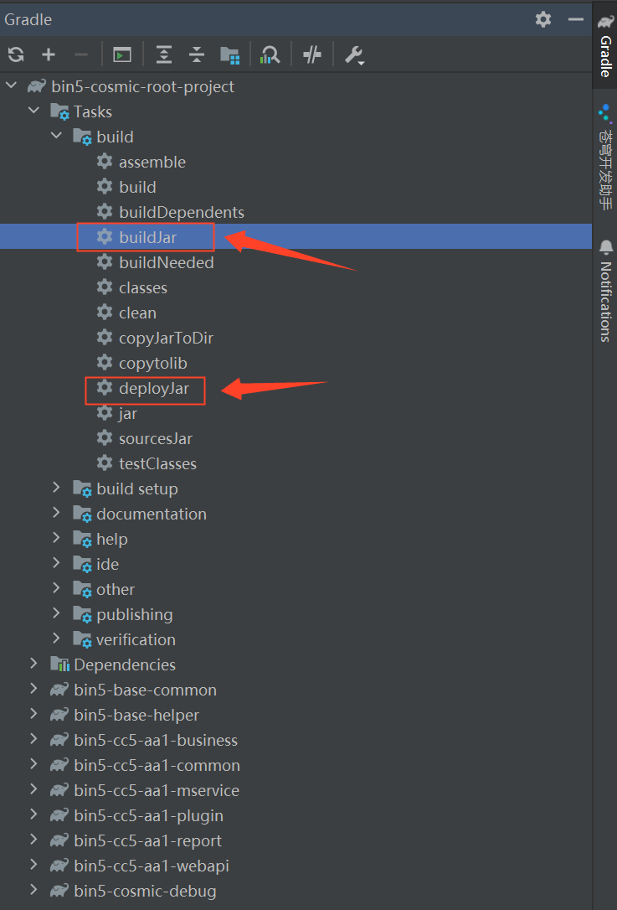
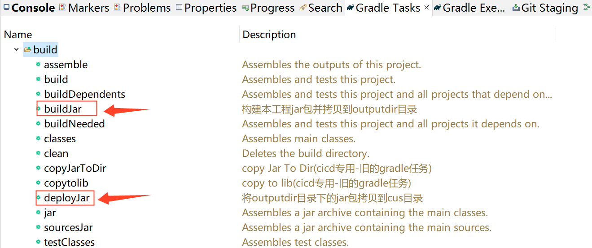
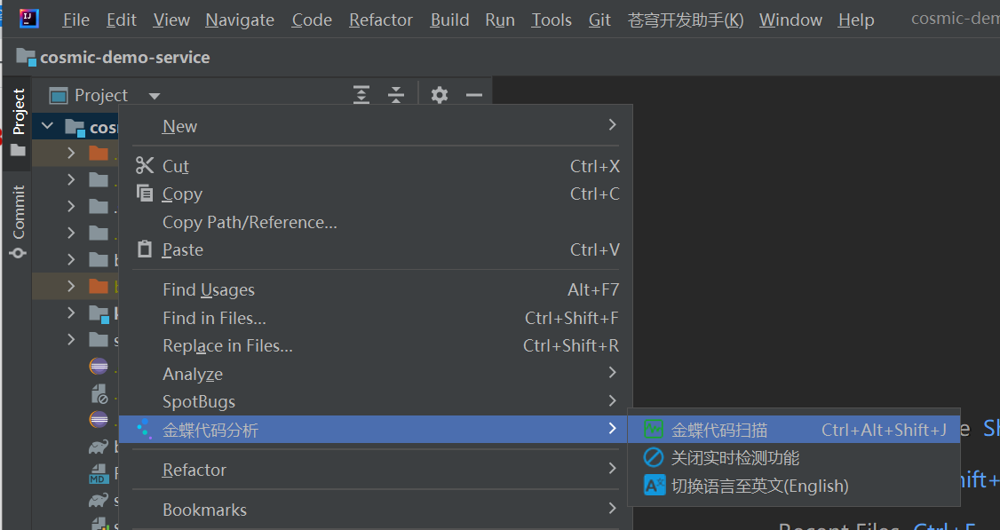

# 金蝶云苍穹Gradle模板使用说明

## 1.启动服务

### 1) DebugApplication中设置好环境必要的参数

- setClusterNumber: 集群编码
- setTenantNumber: 租户编码
- setMcServerUrl: 设置MC服务地址
- setCosmicWepPort: 设置苍穹服务端口
- setConfigUrl: 设置zk服务地址及用户密码
- setFsServerUrl: 设置文件服务地址
- setImageServerUrl: 设置图像服务地址


例：

```java
cosmic.setClusterNumber("cosmic");
cosmic.setTenantNumber("sample");
cosmic.setMcServerUrl("http://127.0.0.1:8090");
cosmic.setCosmicWepPort(8080)
cosmic.setConfigUrl("127.0.0.1:2182?user=zk&password=xxxxxx");
cosmic.setFsServerUrl("127.0.0.1", 8100);
cosmic.setImageServerUrl("127.0.0.1", 8100);
```


### 2) 启动服务

```java
kd.cosmic.DebugApplication
```
首次运行，请检查项目默认的JDK，确保为1.8版本，否则会提示启动异常。


### 3) 登录
启动完毕后打开：http://127.0.0.1:8881/ierp

注意：此处的端口为setCosmicWepPort所配置的具体端口数值


## 2.更新环境
菜单操作路径：苍穹开发助手-->更新环境

将从MC服务器上更新最新包：cosmic.zip、webapp.zip，解压到统一的苍穹资源目录下，可通过系统环境变量"COSMIC_HOME"或项目中gradle.properties的"systemProp.cosmic_home"配置项指定。

默认的web静态资源目录为：System.getenv("COSMIC_HOME") + "/static-file-service"，也可通过以下代码修改：

```java
cosmic.setWebResPath("xxx/static-file-service")
```

注意：更新版本时请先停止在正在跑或调试的工程，避免文件占用无法覆盖。

## 3.工程打包与部署

工程打包有多种方式，可通过Idea或Eclipse中Gradle命令界面build菜单下的"buildJar"任务，也可以打开CMD终端使用"gradle buildJar"命令方式实现。

```cmd
cd your_project_dir
gradle buildJar
```

Jar包部署有多种方式，可通过Idea或Eclipse中Gradle命令界面build菜单下的"deployJar"任务，也可以打开CMD终端使用"gradle deployJar"命令方式实现。

```cmd
cd your_project_dir
gradle deployJar
```

推荐开发工具自带的Gradle构建菜单进行工程的构建、清理及部署等任务。

Idea Gradle工具菜单如下图：

 


Eclipse Gradle工具菜单如下图：

 


## 6.金蝶代码扫描
右键项目工程目录，在右侧菜单中，点击“金蝶代码分析/金蝶代码扫描”功能，即可实现对该工程代码的静态代码扫描。

 
 

## 5.插件选项
菜单操作路径：File->Settings->苍穹开发助手


## 6.搜索工具窗
菜单操作路径：View->Tool Windows->苍穹开发助手

若当前为苍穹工程(工程根目录下有cosmic.properties文件)，苍穹开发助手自行显示，停靠在右上角。

提供文档检索功能。


## 7.菜单-登录开发者门户
未登录：苍穹开发助手(工具窗)-社区文章-可搜索“开发者社区”文档
登录后：苍穹开发助手(工具窗)-社区文章-可搜索“开发者社区+开发者门户”文档

## 8.常见问题
8.1. 忘记ZK账号密码，可通过从MC服务查看的环境变量configUrl，或可通过SQL在MC数据库实例中查询，参考如下SQL

```sql
select t.furl, t.fusername, t.fpassword from t_mc_zookeeper t ;
```

## 9.相关文档

	1、苍穹开发者工具下载与安装
	https://developer.kingdee.com/article/418778103486608384
	
	2、金蝶云·苍穹开发环境搭建
	https://developer.kingdee.com/article/418816210550117376
	
	3、金蝶云·苍穹开发者助手插件安装
	https://developer.kingdee.com/article/476393455359492608
	
	4、金蝶云·苍穹代码规范扫描介绍
	https://developer.kingdee.com/article/476783839013202176
	
	5、新版苍穹开发助手如何导入本地已有的项目或工程模块 
	https://developer.kingdee.com/article/517721581637036032
	
	6、苍穹开发助手Debug工程启动报zookeeper认证错误-NoAuth 
	https://developer.kingdee.com/article/517758258006900992
	
	7、苍穹debug工程启动或编译报GC错误: Out fo Memory或GC overhead limit 
	https://developer.kingdee.com/article/519826723685411072
	
	8、启动苍穹本地debug服务的控制台日志卡在CuratorFrameworkImpl这一行
	https://developer.kingdee.com/article/519891614198842112
	
	9、IDEA启动命令行过长解决办法
	https://vip.kingdee.com/article/357806944599232512
	

## 🤝 联系我们

请使用云之家扫描以下二维码。

### 苍穹开发者工具交流反馈群
 

