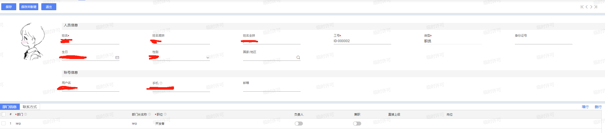

# 表单设计

## 导言

表单（Form）是一种在网页上收集用户输入的数据的结构。它允许用户通过填写不同的输入字段（如文本框、复选框、单选按钮、下拉列表等）来提交信息给服务器。表单是Web开发中的基本组件之一，广泛应用于各种网站和Web应用程序中。

以人员表单举例

一个苍穹表单主要包含字段、组件、属性配置等。并且还可以添加各种按钮，来实现相应表单功能。在这一章节，我们就将学习苍穹的各个表单设计。

## 基础资料

### 基础资料简介

基础资料表单顾名思义就是基础的资料表单。用于存放一些需要引用的物料、物品等。如在本节的课程任务中，我们主要完成书籍基础资料的设计。在后续，我们需要在很多地方读取书籍信息。所以，书籍基础资料是一切与书籍相关操作的初始，如借阅、预约、归还等。

在书籍基础资料中，我们可以设计以下字段：

* 书籍基本信息

  * 书籍图片（ozwe_picturefield）
  * 书籍ISBN码（number，模板自带）

  * 书籍名称（name，模板自带）

  * 书籍作者（ozwe_author）
  * 书籍类别（ozwe_type）

  * 出版社（pzwe_press）

  * 发行日期（ozwe_datetime）

* 书籍库存信息
  * 书籍数量（ozwe_amount）
  * 存放位置（ozwe_addr）
  * 借阅状态（ozwe_combo）
  * 创建人（creator，模板自带）
  * 创建日期（createtime，模板自带）
  * 书籍状态（status，模板自带）

### 基础资料创建步骤

#### 第一部分：创建页面

点击页面创建页面按钮，打开页面创建向导.

选择基础资料，并点击下一步，到按模板选择界面，再次点击下一步。

选择基础资料，在本次的课程中，我们需要选择**基础资料模板**，其余模板的介绍可以前往[该链接](https://developer.kingdee.com/article/235763367267672576?specialId=218022218066869248&productLineId=29&isKnowledge=2&lang=zh-CN)进行了解，这里不做讲解。

填写表单编码和名称，编码格式为：**开发者标识_编码**，如这里的**ozwe_book**，名称就叫**书籍大全**

#### 第二部分：了解页面结构

完成创建后，会自动跳转到新建的页面中。在下面的图片中可以看到，一个基本的表单开发页面，主要分为三个结构，分别是**控件栏、表单页面区域、属性栏**

同样，我们可以在该页面中查看表单页面的结构。在左边的控件栏中，点击中间的按钮，前往大纲栏。

点击大纲树形列表中的控件，可以看到该控件会在表单页面中被选中。

同样，在基础资料模板中，基本信息容器的上方还有一行**工具栏**，工具栏中存放各种按钮，用于执行表单操作，如提交、保存、审核等，具体的操作后面的章节再讲。

选中树形列表中的头部，即书籍大全，可以看到右边的属性栏中可以编辑相应表单信息。以下是对右边常用属性的介绍：

* 标识：表单标识，创建时填写的标识
* 名称：表单名称
* 宽度和高度：不填则默认为充满，若填写则为填写的值
* 界面规则：界面显示规则，在后面的章节中介绍
* 插件：页面表单插件，在后面的章节中会介绍
* 业务规则：可配置表单字段间数据流通，后面的章节中介绍
* 操作：按钮操作，默认有保存、提交、审核等操作，与按钮绑定，具体使用方法后续会介绍
* 表名：一张基础资料会对应数据库中的一张表，即创建表单后，PostgreSQL数据库中也会同步创建一张表，用于存放该表单的数据。表名则为数据库中的表名信息，命名规则为：tk_表单编号，在之后会进行实操演示

前往样式选项界面中，可以详细调整表单样式，布局也是同理。具体的使用方法后续会详细介绍，在这里可作了解，也可自行琢磨。

#### 第三部分：添加字段

选中容器区域

选择左方字段，点击添加

修改字段信息，以下则以添加书籍作者字段为例。

**<u>注意：新建字段后，一定要修改标识、字段名称、字段名</u>，以养成良好的编程习惯。**字段名则为该字段保存到数据库中的字段名，命名规则为：**fk_字段标识**，如以下的fk_ozwe_author

#### 第四部分：编辑字段

由于模板中提供了部分字段，因此我们可以选择隐藏掉本次表单使用不到的字段，如**使用状态、主数据内码**，选中字段，在右方点击隐藏元素即可。

隐藏完成之后，我们可以修改其余信息，与我们想设置的字段相符合。如**把编码改为ISBN码，名称改为书籍名称**，如下图所示。

#### 第五部分：增删改剩余字段

修改完后，我们可以添加之后的字段。为了界面层次的美观，我们可以选择再复制一个承装基本信息的容器

复制成功之后，可以修改容器名称。选中容器，修改名称即可。

将容器复制过来之后，我们需要删除重复的字段，添加新字段。

按照字段创建计划，我们需要将书籍状态和创建人放入到库存基本信息中去，因此这里我们可以拖动字段，拖动至下方的库存基本信息容器中。

并且按计划添加完成剩余字段。

其中**借阅状态**我们可以设计添加为下拉项字段，并附上三个选项，分别是**可借阅、借阅中、不可借阅**

首先选中下拉项字段，选择下拉项右方三个点

添加下拉项内容，即下拉标题和下拉值。下拉值主要在进行业务规则配置和插件编写的时候有作用，请不要胡乱填写下拉值。

添加完成之后，我们可以移动控件位置，至合适的位置。

添加成功之后，我们可以添加图片控件，用于存放用户书籍图片，并移动到合适的位置。

最后还差一个创建时间字段。该字段模板已经提供，但是处于隐藏状态。因此我们需要将这个字段拉入到我们的基本信息容器中。前往大纲页面，找到系统隐藏字段，将创建时间拖动到库存基本信息容器中。

#### 第六部分：保存表单

至此，该表单的基本内容设计完成，我们需要保存该表单。就像以上所讲，在保存之前，我们需要给表单设置一个表名，让该表单成功储存到数据库中。

请问大纲栏，选中第一个书籍大全，填写表名，填写规范为**tk_表单标识**，如这里的tk_ozwe_book，填写完成后保存即可。

点击预览就可以看到设计成功的表单了。

