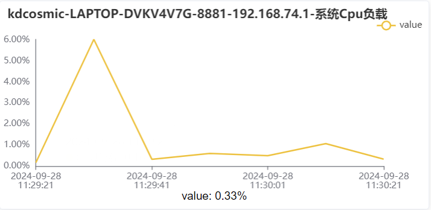

# 苍穹MQ开发

## MQ的概念

> MQ(message queue)，本质是个队列，队列中存放的内容是message，是一种跨进程的通信机制，用于上下游传递消息。一般用来解决**应用解耦、异步消息、流量削峰**等问题，实现高性能、高可用、可伸缩和最终一致性架构。

- 应用解耦：但有多个部件在系统中，如果一个部件出现故障 ，故障部分要处理的内存被缓存在消息队列中从而不影响其他部件的运作，提升系统的可用性。
- 异步消息：一些服务之间是异步的，通过MQ，前一个任务不需要查询下一个任务的API，而是直接用MQ来解决。
- 流量削峰：在高峰期，如果有超出额度的，只能限制不允许用户下单。使用消息队列做缓冲，我们可以取消这个限制，把一秒内下的订单分散成一段时间来处理，这时有些用户可能在下单十几秒后才能收到下单成功的操作，但是比不能下单的体验要好。

## MQ的使用

相关教程：

- [MQ的相关配置](https://vip.kingdee.com/article/316882666815440896?specialId=282527627108140288&productLineId=29&isKnowledge=2&lang=zh-CN)

- [MQ的简单应用](https://vip.kingdee.com/article/316943021625161472?specialId=282527627108140288&productLineId=29&isKnowledge=2&lang=zh-CN)

步骤引导：

1. 在IDEA配置相关MQ的信息

- 在`DebugApplication`加上`cosmic.setMqConsumerRegister(true, "yourMQName");`，后面是自己命名的名字
- 在对应插件目录下的`\src\main\resources`添加`\erkai\consummqconfig.xml`，并在其中进行配置

```xml
<root>
    <region name="myg6_Intelligent_lib">
        <queue name="erkai_queue" appid="myg6_extended_funs">
            <consumer class="plugins.MQ.DemoConsumer"></consumer>
        </queue>
    </region>
</root>
```

2. 书写一个消费者实现类，用于消费者执行提交动作

`DemoConsumer`

```java
package plugins.MQ;

import kd.bos.dataentity.entity.DynamicObject;
import kd.bos.logging.Log;
import kd.bos.logging.LogFactory;
import kd.bos.mq.MessageAcker;
import kd.bos.mq.MessageConsumer;
import kd.bos.orm.query.QCP;
import kd.bos.orm.query.QFilter;
import kd.bos.servicehelper.BusinessDataServiceHelper;
import kd.bos.servicehelper.operation.SaveServiceHelper;

public class DemoConsumer implements MessageConsumer {
    Log log = LogFactory.getLog(getClass());
    @Override
    public void onMessage(Object message, String messageId, boolean resend, MessageAcker acker) {
        log.info("自定义DemoConsumer开始消费");
        try {
            QFilter qFilter = new QFilter("billno", QCP.equals, "MQ8888888");
            DynamicObject obj = BusinessDataServiceHelper.loadSingle("myg6_mq", new QFilter[]{qFilter});
            obj.set("myg6_integerfield", (int) message);
            SaveServiceHelper.update(obj);
        } catch (Throwable e) {
            boolean discard = false;
            if (discard){
                acker.discard(messageId);
            } else{
                acker.deny(messageId);
            }
        }
    }
}
```

3. 书写一个表单点击插件，配置MQ下行为，和非MQ下行为

`plugins.MQ.MulThreadsEdit`

```java
package plugins.MQ;

import kd.bos.bill.AbstractBillPlugIn;
import kd.bos.dataentity.entity.DynamicObject;
import kd.bos.form.control.events.ItemClickEvent;
import kd.bos.logging.Log;
import kd.bos.logging.LogFactory;
import kd.bos.mq.MQFactory;
import kd.bos.mq.MessagePublisher;
import kd.bos.orm.query.QCP;
import kd.bos.orm.query.QFilter;
import kd.bos.servicehelper.BusinessDataServiceHelper;
import kd.bos.servicehelper.operation.SaveServiceHelper;

public class MulThreadsEdit extends AbstractBillPlugIn{
    Log Logger = LogFactory.getLog(MulThreadsEdit.class);
    @Override
    public void itemClick(ItemClickEvent evt) {
        if (evt.getItemKey().equals("myg6_concurrent")) {
            // 普通处理
            for (int i = 1; i < 10000; i++) {
                QFilter qFilter = new QFilter("billno", QCP.equals, "MQ8888888");
                DynamicObject obj = BusinessDataServiceHelper.loadSingle("myg6_mq", new QFilter[]{qFilter});
                obj.set("myg6_integerfield", i);
                SaveServiceHelper.update(obj);
            }
        } else if (evt.getItemKey().equals("myg6_mq_concurrent")) {
            // 使用MQ处理
            MessagePublisher mp = MQFactory.get().createSimplePublisher("myg6_Intelligent_lib", "erkai_queue");
            for (int i = 1; i < 10000; i++) {
                mp.publish(i);
            }
        }
    }
}
```

4. 配置一个表单，里面有一些基础信息，配置的过程参考教程中的第二个来进行配置。

## MQ的效果检验

1. 来到`Monitor监控中心`，一般是http://127.0.0.1:8881/monitor/eye/#/home/index

若不一样，可以这样修改。首先打开自己的苍穹界面。例如我的是http://127.0.0.1:8881/ierp/login.html，我将后面的`/ierp/login.html`替换成`/monitor`，就可以调转到监控中心了。

2. 来到集群监控下的指标监控

   

3. 点击进入之后可以看到负载情况


4. 直接处理 vs MQ处理

分别点击两个按钮，观察运行的时间，以及`Monitor`处相关的曲线走向。

