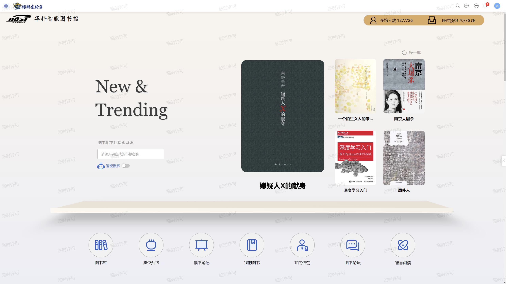

# 控件
## 导言
经过了前面两章的学习，相信你已经掌握了基本的页面设计，以及插件的运用。那么现在我们已经可以进行控件的学习了！通过本章，你可以学习到单据体的运用，让你的单据可以支持更复杂的情况。同时，我们还将学习如何通过动态表单开发一些更加美观，更加个性化的页面。
比如这个应用首页：

再比如这个预约座位的页面：

## 控件总体介绍
苍穹开发平台使用封装好的控件来开发表单，可以极大的减少工作量，缩短开发周期。
在开发页面的左侧，可以看到苍穹平台提供的丰富的控件：

这些控件可以根据是否会在数据模型中存储数据，大致分为通用控件与字段控件两类。接下来的课程中，我们将围绕书籍基础资料和座位预约页面这两个场景，讲解一些重要控件的用法。