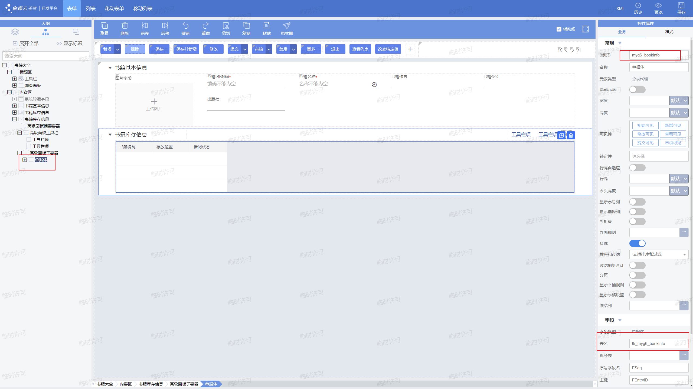

# 重要控件介绍
## 书籍基础资料单据体
### 导言
我们在第一章中制作了储存书籍信息的基础资料，可以存放书籍的封面，作者等关键信息。可是如果我们的图书馆有多本同样的图书呢？我们该怎样表示每一本图书的存放位置，借阅情况呢？这时就要用到单据体了。

单据体可以用于展示一批具有相同属性的数据，类似Excel。在业务语义上一个单据体对应数据库中一张表，其中一列对应数据库表的一列，可以编辑录入数据。

### 章节目标
修改第一章完成的书籍基础资料，增加一个单据体，用来表示这种书籍，每一本实体书的存放位置以及借阅情况。
同时实现借书的相关插件，从而对单据体进行操作。

### 实现步骤

#### 1.新增并配置单据体控件

首先我们在内容区中添加一个高级容器，高级容器预置了两个工具栏项按钮，可以方便我们配置单据体的新增一行与删除一行的按钮：


然后在这个高级容器的子容器里面添加一个单据体：


删除书籍库存信息里面的存放位置，借阅状态两个字段，并把他们重新添加到单据体里面。同时，为了区分不同的书，我们还要单据体中增加一个书籍编码字段（myg6_code）：


然后我们就可以把上面旧的书籍库存信息隐藏了（因为含有继承字段不能直接删除），然后将高级容器更名为新的书籍库存信息。


别忘了单据体**也需要注册表名**， 在大纲中选中并进行注册:



然后我们要进行工具栏项的配置，选中一个工具栏项并点击操作代码右侧的三个点：


点击新增：


打开操作类型的选择界面，并点击过滤按钮进行查询：


查找“新增”，并选择新增分录，这个操作可以实现单据体新增一行的操作。同样的办法将另一个工具栏项配置为删除分录：


保存并点击预览，可以看到可以通过这两个按钮进行单据体的操作：


我们将这本书添加到列表中，方便我们后续的演示：


#### 2.编写借书插件

第二步我们就要编写借书插件了，这里我们想要实现的流程是，当用户提交借书单据 ，点击审核时，遍历所有的图书库存，将最先遍历到的可借阅的书籍借给这名用户。如果没有可借阅的书，则弹窗提示。

代码非常简单，需要注意的是，使用`BusinessDataServiceHelper`进行查询时，`Fields`中要加入单据体标识和单据体内要查询字段的标识，完整代码如下：

```java
package plugins.teach;

import kd.bos.base.AbstractBasePlugIn;
import kd.bos.dataentity.entity.DynamicObject;
import kd.bos.dataentity.entity.DynamicObjectCollection;
import kd.bos.form.control.events.ItemClickEvent;
import kd.bos.orm.query.QFilter;
import kd.bos.servicehelper.BusinessDataServiceHelper;
import kd.bos.servicehelper.operation.SaveServiceHelper;
import kd.sdk.plugin.Plugin;

/**
 * 基础资料插件
 */
public class BorrowOneBook extends AbstractBasePlugIn implements Plugin {
    public void itemClick(ItemClickEvent e) {
        super.itemClick(e);
        // 若检测到点击到审核按钮
        if (e.getItemKey().equalsIgnoreCase("bar_audit")) {
            // 查看列表
            String fields = "name,myg6_bookinfo,myg6_combo";
            QFilter[] filters = new QFilter[0];
            DynamicObject[] dys = BusinessDataServiceHelper.load("myg6_book", fields, filters);
            String borrowBookName = (String) this.getModel().getValue("myg6_name");


            Boolean haveBook = false;
            for (DynamicObject obj : dys) {

                String bookName = obj.getString("name");
                if(bookName.equals(borrowBookName)){

                    DynamicObjectCollection rows = obj.getDynamicObjectCollection("myg6_bookinfo");
                    for(DynamicObject row: rows){
                        if(row.getString("myg6_combo").equals("0")){
                            haveBook = true;
                            row.set("myg6_combo", "1");
                            SaveServiceHelper.update(obj);
                            break;
                        }
                    }
                }

            }
            //如果haveBook为false，说明没有库存
            if(!haveBook) {
                this.getView().showMessage("没有库存");
            }
        }
    }
}
```


