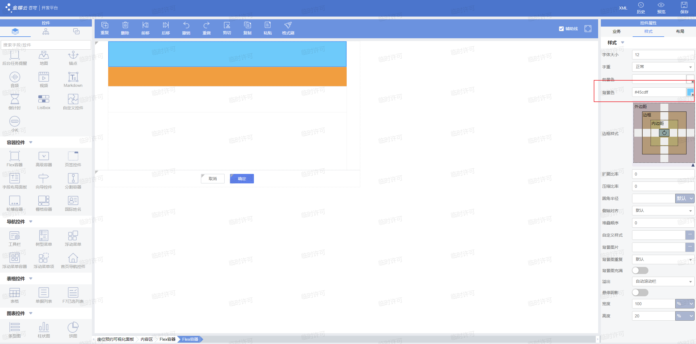

# 重要控件介绍

## 座位预约页面

### 导言
怎样实现座位预约呢？我们当然可以制作一个单据页面，通过填写座位编号的方式来实现。但为了更好的效果，我们可以制作一个可视化的面板，通过点击座位按钮的方式，自动填写这个座位预约单据。预约成功后这个座位将被标记为红色，这样可以大大提升用户体验。


本节我们将以实现一个点击座位按钮，自动生成预定座位单据的页面为目标，学习更多重要控件的用法，最终的效果如下：


### 实现步骤
- 制作座位预约单据
- 利用flex容器实现页面布局
- 添加图片控件并注册点击事件
- 完善座位选择面板插件

### 一、实现座位预约单据

首先，我们要实现这样一个座位预约单据，编码为：myg6_seat_reserve，具体结构如下，可以不需要这么复杂，只要有座位基础资料字段即可。多余字段可以按需求添加：


然后要为这个单据编写插件，单据提交后将对应的座位由空闲变为已预约。相信经过了第一章和第二章的学习，你可以很熟练地完成这个部分。


### 二、利用flex容器实现页面布局
要画出座位选择的可视化面板，我们首先要学会，**应该如何控制每个控件在表单中的位置？** 这时我们就需要借助**flex容器**的帮助了。具体操作请看下面的步骤：

首先，我们需要先创建一个空白的动态表单，选择如下模板：


创建好后，我们可以先把右上角的辅助线功能打开,这样可以看到每个flex容器的轮廓，非常方便：


然后我们要分解页面的结构：


如上图所示，这个页面总体分为红框所框出的三部分，我们先添加一个flex容器，将它的宽度调成90%，作为整个页面的容器：


在页面右侧的样式栏里面，我们可以调整控件的各种样式，这里的扩展比率和压缩比率可以控制子控件在父控件中占据的比例，详细的内容可以参考[这篇文档](https://vip.kingdee.com/article/252017936767406336?productLineId=29&isKnowledge=2&lang=zh-CN)，这里我们想要通过设置宽度与高度，手动控制控件的大小，扩展比率和压缩比率全都置为0即可：


为了让这个容器能够居中，我们可以调整内容区的布局，我们可以在左侧的页面大纲中选中内容区：


我们点击右侧的布局，然后选择垂直布局，水平居中，这样我们添加的flex容器就成功居中了：


然后我们在这个flex容器里面再添加三个flex容器，分别用来表示窗户，桌子，和座位区，宽度均设为100%，高度分别设成20%，15%，20%。为了便于区分，我们将这三个容器分别命名为窗户区，桌子区，椅子区，我们后面也会这样称呼这三个flex容器。然后将父容器的布局也调成垂直布局，这样这三个容器就可以垂直排列：


然后我们在样式里调整一下窗户区和桌子区的背景色，这样他们就像现实中的窗户与桌子了！



为了让用户更加清楚，我们可以在窗户区上面标注窗户这两个字，我们可以通过标签控件来显示文本。我们在窗户区中增添一个标签控件，然后将它的名字改为窗户，字号设为40：


然后我们要想办法将这个标签控件设为居中，相信你一定知道该怎么实现。想要控制子控件的位置，就要调整包含它的父控件的布局：


如果我们想让桌子和窗户之间有一定的间隔，可以在样式中设置。这里我们将桌子区顶部的外边距设为10，可以看到桌子成功下移了10个像素：


### 三、添加图片控件并注册点击事件

接下来，我们就要设置椅子了，我们先在椅子区里面增加一个flex容器，用来装椅子。因为我们想要设置8个椅子，所以我们把这个容器的宽度设为12.5%，高度设为100%：


我们在这个flex容器里面加入一个图片展示控件，将它设为居中，然后我们将它的宽度和高度都设为35px，再将展示的图片设置成我们上传的座位图标。关于如何上传图片到苍穹资源中，可以参考[这篇文档](https://vip.kingdee.com/article/327137696877484288?productLineId=29&lang=zh-CN)。最后我们开启允许点击按钮，这样我们之后就可以**在插件中为这个图片展示控件注册点击事件**。在苍穹中，不只有按钮可以进行点击，图片展示，标签，甚至是flex容器本身都支持点击事件。


为了实现预定的座位置为红色，我们可以在这里放置两个座位按钮，一个是黑色一个是红色，这样我们在插件中判断座位是否被预约过，然后将对应颜色的座位置为可见，另一个置为不可见就可以了。我们可以利用苍穹开发者工具的**重复与复制粘贴功能**，快速地完成页面中重复的部分。

我们先选中这个座位，然后点击重复，可以看到这个座位被成功复制了一份：


然后我们将复制出来的图片换成红色的座位：


最后，我们选中包含这两个座位按钮的flex容器，将他复制七份，页面就画好了，是不是非常简单呢？像搭积木一样：


点击保存后进行预览，可以看一下页面的效果，不过这里我们还没有编写插件，所以两个座位一起显示出来了：


### 四、完善座位选择面板插件

经过上面的步骤，我们已经实现了座位预约可视化面板的可视化部分，可是这个页面还不能用。为了实现最终的效果，我们还要为这个页面编写插件。

首先，我们要做的是改变座位按钮的标识，因为在苍穹系统中，插件是通过控件的标识，来控制这个控件的，所以为了方便后面插件的编写，我们先统一座位按钮的标识。我们把黑色的座位按钮标识从左至右分别置为"myg6_black1"~"myg6_black8", 红色置为"myg6_red1"~"myg6_red8"：


然后我们创建一个名为SeatSelect的插件，继承AbstractFormPlugin。首先定义需要用到的标识，方便管理：

```java
    //定义标识
    private final String BLACK_SEAT = "myg6_black";
    private final String RED_SEAT = "myg6_red";
    private final String SEAT_SELECT = "myg6_seat_select";
    private final String SEAT_APPLY = "myg6_seat_apply";
```

然后我们需要按照下面的方式，利用registerListener注册所有黑色与红色座位按钮的点击事件：

```java
    @Override
    public void registerListener(EventObject e) {
        super.registerListener(e);
        //注册座位按钮控件的监听
        for(int i = 1;i <= 8;i++){
            this.addClickListeners(BLACK_SEAT + i);
            this.addClickListeners(RED_SEAT + i);
        }

    }

```

因为我们需要实现根据这个座位是否被预定，来决定是显示黑色的座位按钮，还是红色的。所以我们要在afterCreateNewData中来实现对应的逻辑，具体思路看代码注释

```java
    @Override
    public void afterCreateNewData(EventObject e) {
        super.afterCreateNewData(e);
        for(int i = 1;i <= 8;i++){
            //这里的S00000是座位号的前缀，根据你在座位基础资料里的编码设置来修改
            String str = "S00000";
            QFilter qFilter = new QFilter("number", QCP.equals, str + i);
            //根据座位号查询座位基础资料
            DynamicObject goalSeat = BusinessDataServiceHelper.loadSingle("myg6_seat", new QFilter[]{qFilter});

            //判断座位是否被预定，然后设置座位的可见性
            if (goalSeat.getString("myg6_combofield").equals("1")) {
                this.getView().setVisible(false, BLACK_SEAT + i);
            } else{
                this.getView().setVisible(false, RED_SEAT + i);
            }
        }
    }
```

然后我们就要实现点击事件了，在苍穹的插件中， 注册过点击事件的控件被点击后，将会调用click这个生命周期函数。
在这个函数中，我们首先要判断被点击的是哪个按钮。如果这个按钮颜色是黑色，那就要获取座位的编号，然后用第二章学习过的知识，通过billShowParameter打开座位预约单据，然后填入座位编号。如果是红色，则需要提示这个座位已经被预约：
```java
@Override
    public void click(EventObject evt) {
        super.click(evt);
        //获取被点击的控件对象
        Control source = (Control) evt.getSource();
        if (source != null) {
            for(int i = 1;i <= 8;i++){
                //判断被点击的控件是哪个座位控件
                if (StringUtils.equals(BLACK_SEAT + i, source.getKey())) {
                    //当工作交接安排控件被点击的时候，创建弹出表单页面的对象
                    BillShowParameter billShowParameter = new BillShowParameter();
                    //设置弹出表单页面的标识
                    billShowParameter.setFormId(SEAT_APPLY);
                    //设置弹出表单页面的标题
                    billShowParameter.setCaption("请补充座位预定时间段~");
                    //设置弹出表单页面的打开方式
                    billShowParameter.getOpenStyle().setShowType(ShowType.Modal);

                    //设置弹出表单页面的座位号参数
                    billShowParameter.setCustomParam("myg6_basedatafield_seat","S00000" + i);

                    //设置弹出表单的样式，宽，高等
                    StyleCss styleCss = new StyleCss();
                    styleCss.setHeight("600");
                    styleCss.setWidth("900");
                    billShowParameter.getOpenStyle().setInlineStyleCss(styleCss);
                    //弹出表单和本页面绑定
                    this.getView().showForm(billShowParameter);

                    //将黑色座位设置为红色
                    this.getView().setVisible(false, BLACK_SEAT + i);
                    this.getView().setVisible(true, RED_SEAT + i);
                    break;
                } else if (StringUtils.equals(RED_SEAT + i, source.getKey())) {
                    //如果红色座位被点击，则提示该座位已被预定
                    this.getView().showMessage("该座位已被预定，请选择其他座位");
                }
            }

        }
    }
```

