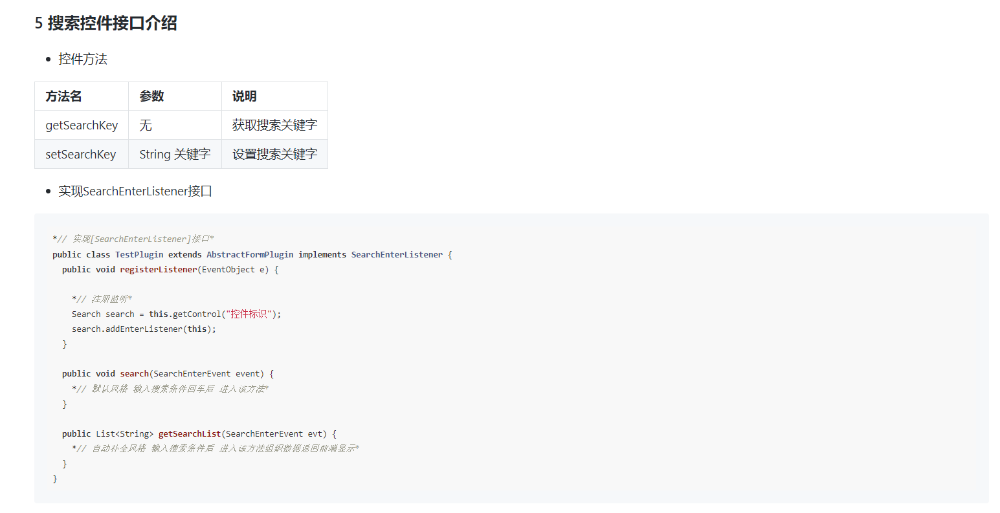
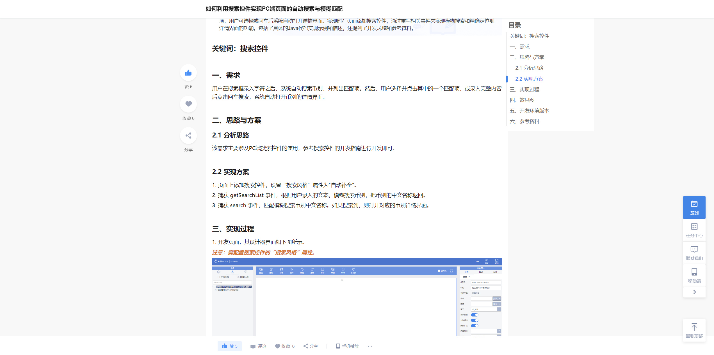
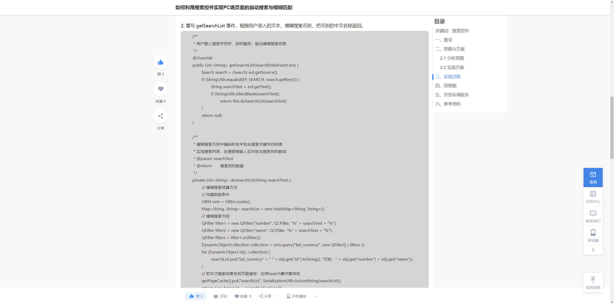
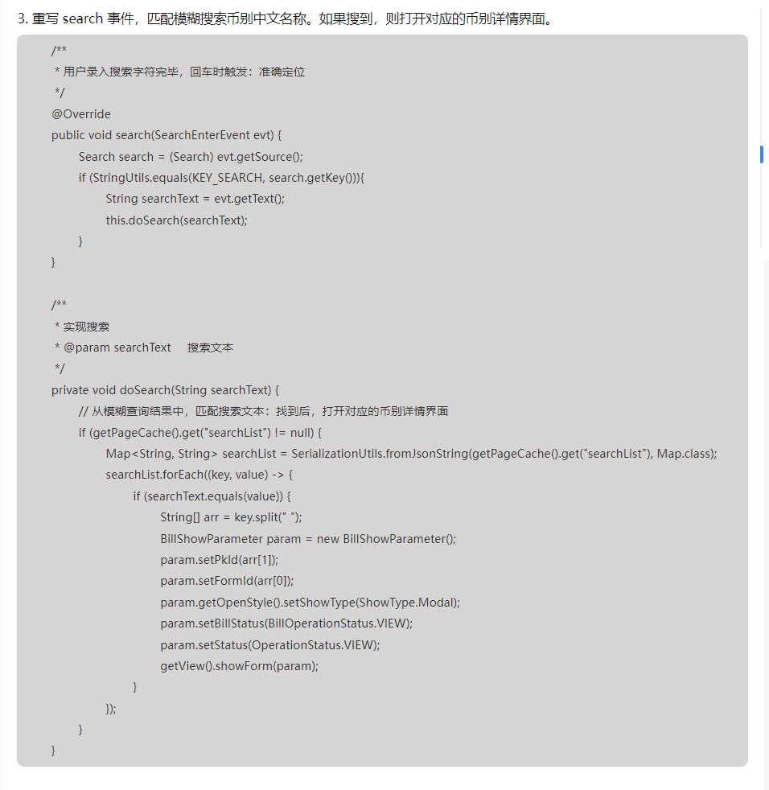
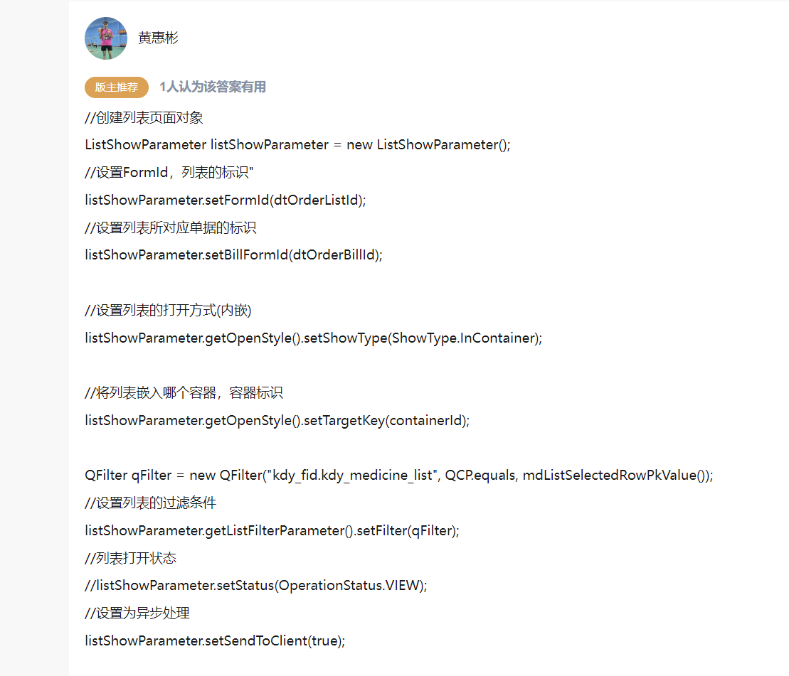
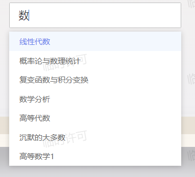
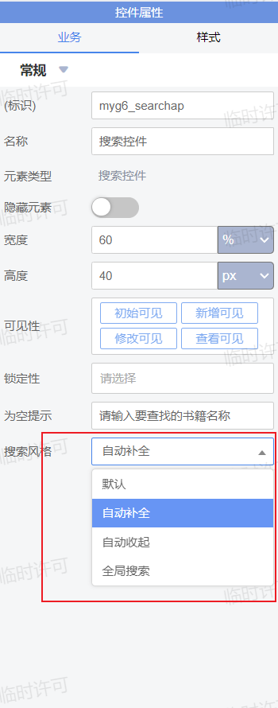
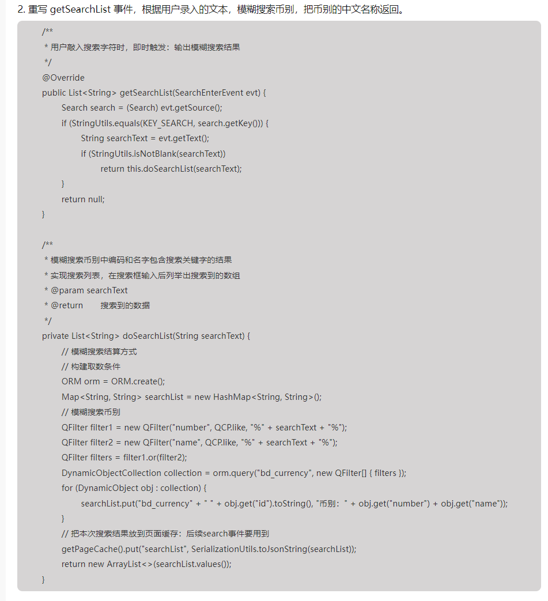

# 其他控件介绍
## 导言
本章我们介绍iframe控件与搜索控件，帮助您设计更复杂的页面，实现更加好用的功能。
希望你能通过以上的案例，在社区文档的帮助下，自行掌握所有控件的用法。

## 更多控件

### iframe控件
#### 简介
iframe控件可以让你很方便地显示第三方链接进来的网站内容，当与第三方合作开发时，如有需要引入对应模块，可以通过iframe将其嵌入到项目中。
如果有一些自己开发的服务，也可以通过iframe控件嵌入到项目中，下面我们将介绍如何将自己开发的项目通过iframe中，同时实现传参交互。


#### 设置src
```java
IFrame iframe = this.getView().getControl("控件标识");*// 设置url*
iframe.setSrc("value");//这里填入项目的ip地址即可
```

#### 向iframe中发送一个消息

``` java
String data = JSON.toJSONString(matchingDataList);
IFrame iframe = this.getControl("myg6_kgview");
IFrameMessage message = new IFrameMessage();
message.setType(type);
message.setOrigin("*");
message.setContent(data);
iframe.postMessage(message);
```

#### 在iframe中接收消息(html文件)

```html
window.addEventListener('message', handlefirst);
function handlefirst(event) {
    let jsonObject = JSON.parse(event.data);
    if (jsonObject.type != 'KGViewbook') {
        console.log("这不是图书关系图谱" + event.data);
        return;
    }
    d3.select('svg').remove();

}
```

#### 从iframe中向金蝶发送消息(html文件)

```html
// 获取当前页面的pageId
let pageId = new URLSearchParams(window.location.search).get('pageId');
let message = {
    pageId: pageId,
    type: 'invokeCustomEvent',
    content: {
        msg: 'your_message',
        methodName: 'other',
        type: 'click',
    }
};
// 向金蝶页面发送消息
window.parent.postMessage(message, '*');
```

#### 在金蝶中接收消息
```java
@Override
public void customEvent(CustomEventArgs e) {
    String key = e.getKey();//自定义控件标识
    String args = e.getEventArgs();//数据
    String ename = e.getEventName();//事件名称:这里默认是invokeCustomEvent
    //提取人物名称
    Map<String, Object> jsonMap = JSON.parseObject(args);
    Map<String, Object> contentMap = (Map<String, Object>) jsonMap.get("content");
    String message = (String) contentMap.get("msg");
    String type = (String) contentMap.get("type");
}
```

### 搜索控件
我们最终以搜索控件为例，讲解一下怎样通过开发者文档与社区案例，完成苍穹控件的学习与使用。
#### 目标
通过搜索控件，实现图书馆首页的图书搜索功能。效果如下：


首先，现在你的页面中添加一个搜索控件，并根据你的想法设定样式。


#### 了解搜索控件的用法

- 通过[开发者社区文档](https://developer.kingdee.com/article/224164535018747136?productLineId=29&isKnowledge=2&lang=zh-CN)：
在文档中我们可以看到对于搜索控件接口的介绍：

- 通过开发者社区中现成的案例：
    我们直接在社区中搜索"搜索控件"，可以找到一些现成的案例：
    

    我们点开这个文章，发现其中实现了一个自动搜索币别的功能，我们可以在这个代码的基础上进行改动，实现我们图书搜索的功能。
    
    
#### 实现图书搜索功能
根据文档中的接口介绍：
```java
*// 实现[SearchEnterListener]接口*
public class TestPlugin extends AbstractFormPlugin implements SearchEnterListener {
  public void registerListener(EventObject e) {
  
    *// 注册监听*
    Search search = this.getControl("控件标识");
    search.addEnterListener(this);
  }
  
  public void search(SearchEnterEvent event) {
    *// 默认风格 输入搜索条件回车后 进入该方法*
  }
  
  public List<String> getSearchList(SearchEnterEvent evt) {
    *// 自动补全风格 输入搜索条件后 进入该方法组织数据返回前端显示*
  }
}
```
首先我们要注册监听：
我们先创建一个新的插件文件，然后进行注册：
```java
package plugins.homepage;


import java.util.ArrayList;
import java.util.EventObject;
import java.util.HashMap;
import java.util.List;
import java.util.Map;

import com.alibaba.fastjson.JSONObject;
import kd.bos.cache.CacheFactory;
import kd.bos.cache.DistributeSessionlessCache;
import kd.bos.dataentity.entity.DynamicObject;
import kd.bos.dataentity.serialization.SerializationUtils;
import kd.bos.dataentity.utils.StringUtils;
import kd.bos.form.FormShowParameter;
import kd.bos.form.ShowType;
import kd.bos.form.control.Search;
import kd.bos.form.control.events.SearchEnterEvent;
import kd.bos.form.control.events.SearchEnterListener;
import kd.bos.form.plugin.AbstractFormPlugin;
import kd.bos.list.ListFilterParameter;
import kd.bos.list.ListShowParameter;
import kd.bos.orm.query.QCP;
import kd.bos.orm.query.QFilter;
import kd.bos.servicehelper.BusinessDataServiceHelper;
import kd.bos.servicehelper.DispatchServiceHelper;

public class SearchPlugin extends AbstractFormPlugin implements SearchEnterListener {

    // 搜索控件标识
    private final static String KEY_SEARCH = "myg6_searchap";

    @Override
    public void registerListener(EventObject e) {
        // 侦听搜索控件的搜索事件
        Search search = getView().getControl(KEY_SEARCH);
        search.addEnterListener(this);
        super.registerListener(e);
    }
}
```
注册完成之后，怎样实现输入关键词后，按下回车进行搜索呢？我们先看文档中关于search方法的介绍：
```java
  public void search(SearchEnterEvent event) {
    *// 默认风格 输入搜索条件回车后 进入该方法*
  }
```
由此看来，我们的搜索相关的逻辑应该在这里实现，如果到这里还是不清楚应该怎么做，我们可以参考之前搜索到的案例，看看它在这个方法里面是怎么做的：



我们可以看到，在他的案例中，先通过`String searchText = evt.getText();`获取到搜索框中的内容，然后再通过`BillShowParameter`打开对应的基础资料的详情页面。

但是我们想要的效果是在列表中显示所有含有查询关键词的条目，所以我们还要在这个代码基础上进行修改。

怎样打开列表并进行过滤呢？我们在社区中搜索，可以找到一些案例：


当然如果你的阅读代码能力比较强的话，我们也可以直接看ListShowParameter类里面的方法：


都可以找到合适的方法解决我们的问题

最终我们实现出图书搜索的dosearch方法：
```java
private void doSearch(String searchText) {

    ListShowParameter lsp = new ListShowParameter();
    lsp.setFormId("bos_list");
    lsp.setBillFormId("myg6_book_list");
    lsp.getOpenStyle().setShowType(ShowType.Modal);
    ListFilterParameter listFilterParameter = new ListFilterParameter();
    QFilter qFilter = new QFilter("name", QCP.like, "%" + searchText + "%");
    listFilterParameter.setFilter(qFilter);
    lsp.setListFilterParameter(listFilterParameter);
    this.getView().showForm(lsp);
    
}
```

到这里我们就可以实现回车搜索了，那么下面这个匹配列表怎么实现呢？



文档中同样有接口的介绍：

```java
public List<String> getSearchList(SearchEnterEvent evt) {
  *// 自动补全风格 输入搜索条件后 进入该方法组织数据返回前端显示*
}
```

按照文档的介绍，我们首先要将搜索风格改为自动补全：



然后我们参考案例中的代码：



经过阅读后，我们发现它这里实现逻辑是，先通过orm查询到币别基础资料，然后通过searchList.put将其放到搜索列表中，从而在页面中显示。
如果我们不会orm的话也不要紧，我们在第二章里面学过`BusinessDataServiceHelper`对吧，用这个也可以达到同样的效果，我们自己实现的代码如下：

```java
private List<String> doSearchList(String searchText) {

    String fields = "number,name";

    QFilter filter1 = new QFilter("name", QCP.like, "%" + searchText + "%");
    QFilter[] filter = new QFilter[]{filter1};

    DynamicObject[] collection = BusinessDataServiceHelper.load("myg6_book_list", fields, filter);
    Map<String, String> searchList = new HashMap<String, String>();
    for (DynamicObject obj : collection) {
        searchList.put("myg6_book_list" + " " + obj.get("number").toString(), "" + obj.get("name"));
    }

    //我们不需要把搜索结果放到页面缓存，所以直接删掉后面的部分。
}
```

到这里，搜索控件的插件就已经编写完毕了，只需要在页面中注册这个插件，功能实现好了。

金蝶有非常多的控件，在这里我们不可能把每个控件都详细介绍一遍，授人以鱼不如授人以渔，通过这个搜索控件的案例，希望你能学会，如何学习并使用一个陌生的控件。


