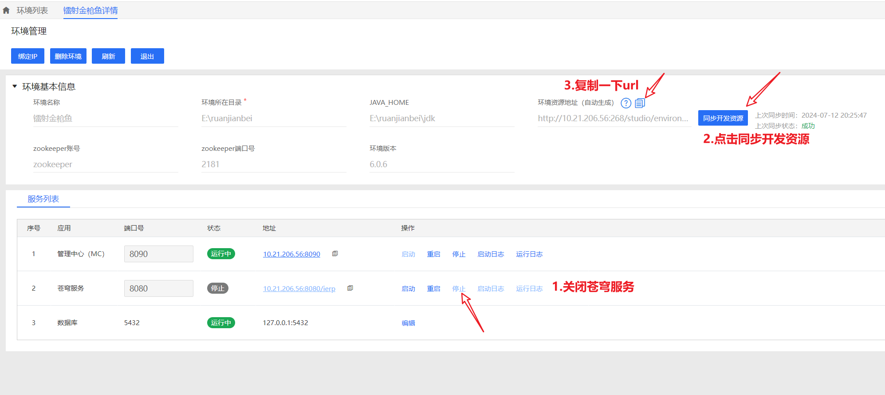
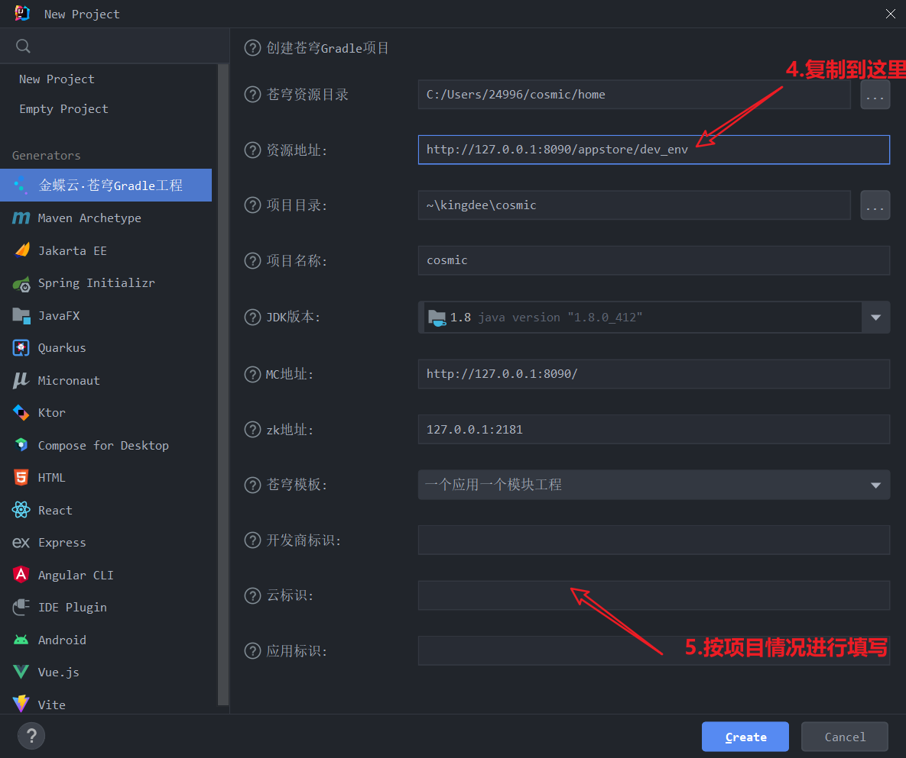
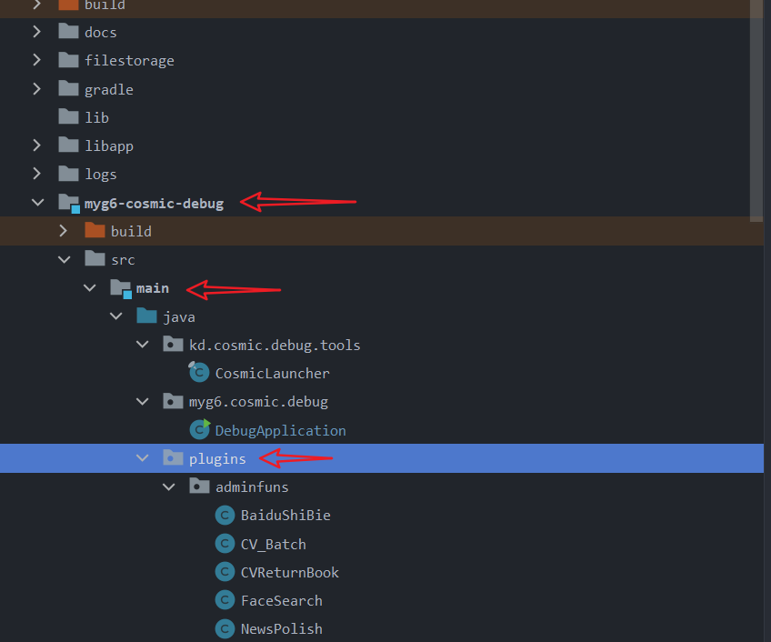
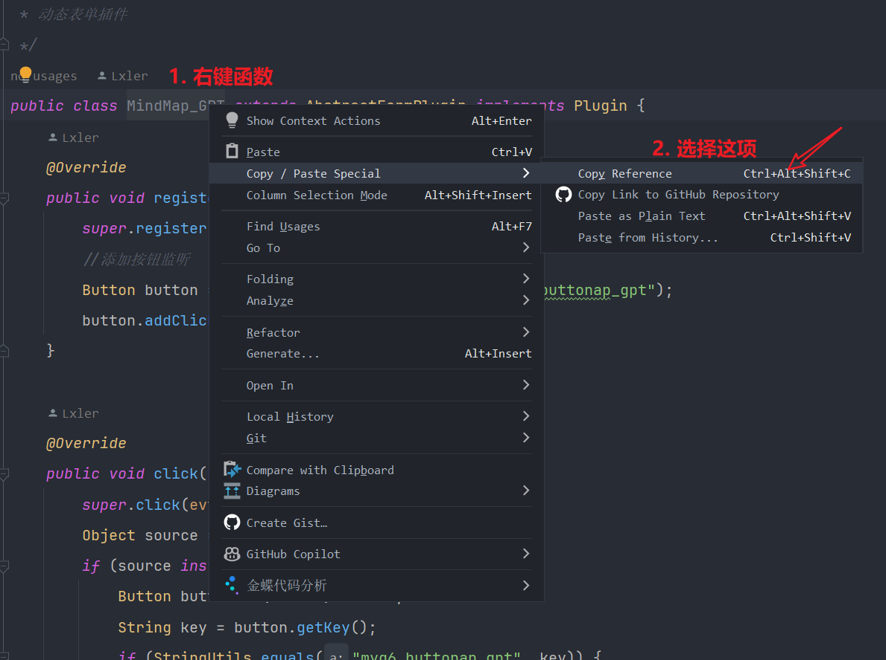
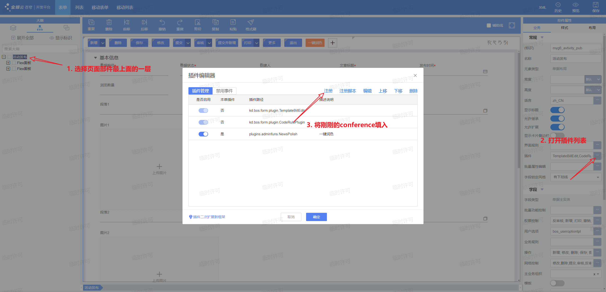
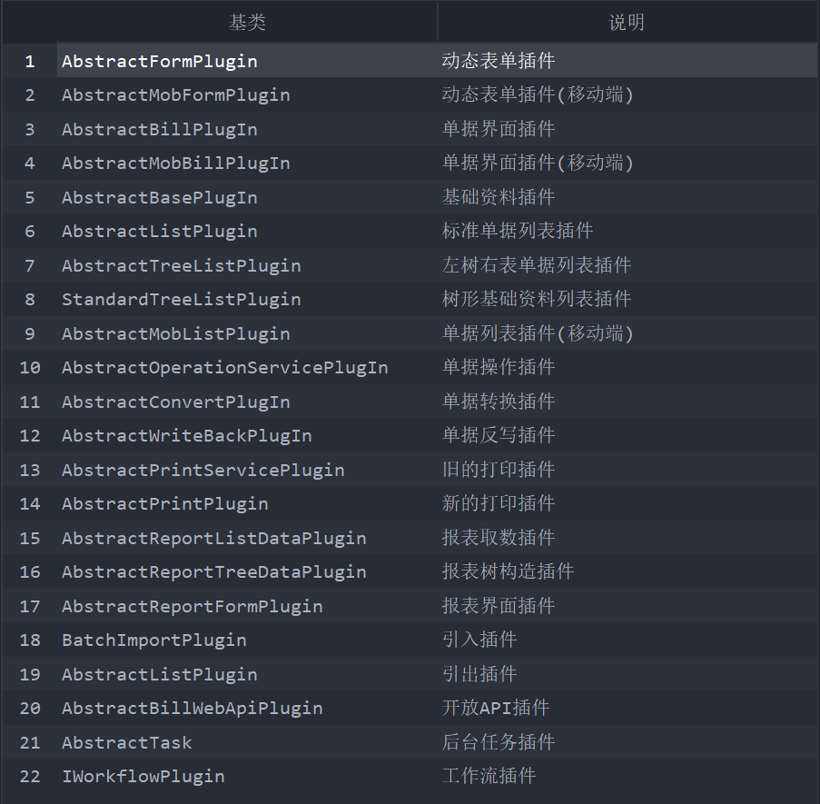

# 插件

## 什么是插件

> 编写插件可以用来完善业务，当在金蝶通过拖拉或规则配置无法满足需求的时候，可以通过插件的编写来完成相对应需求。

## 经典应用

下面列举了一些插件的经典应用场景。

>-  打开表单、单据等页面时弹出相应的消息
>-  <u>获取、修改、控制</u> 当前页面的一些信息
>-  <u>通过 `DynamicObject` 对列表信息进行增删改查</u>
>-  通过 `RequestContext` 获取上下文从而获取登录租户，账套，用户等信息
>-  通过`showParameter` 实现页面传参
>   - 在当前页面的基础上跳转到其他表单
>   - 父界面跳转后给子界面传参
>-  监听点击事件后完成相关业务流程
>-  调度计划中周期性执行相关操作
>-  (省略......) 

## 插件的环境和部署

1. 打开CosmicStudio将资源同步到Idea

>

**注意导入后无法显示则可以尝试==重新同步==一下开发资源。**

2. 编辑`DebugApplication`下的配置

附一段参考代码

```java
public class DebugApplication {

    // 考虑到项目的IP地址实时在变化，可以在这里写成全局的
    public static final String MY_IP = "10.21.206.56";

    public static void main(String[] args) {

        CosmicLauncher cosmic = new CosmicLauncher(false);

        cosmic.setClusterNumber("cosmic");

        cosmic.setTenantNumber("ierp");

        // 这里要填你自己的zookeeper密码
        cosmic.setConfigUrl(MY_IP + ":2181?user=zookeeper&password=zookeeper");

        cosmic.setMcServerUrl("http://" + MY_IP + ":8090/");

        // 设置自己的环境下的static-file-service的路径
        cosmic.setWebResPath("E:/ruanjianbei/static-file-service");

        cosmic.setFsServerUrl(MY_IP, 8100);

        cosmic.setImageServerUrl(MY_IP, 8100);

        // 如果你的项目配置了MQ，在这里设置名字；若没有可以注释掉
        cosmic.setMqConsumerRegister(true, "yourName");
        
        cosmic.setCosmicWepPort(8881);

        cosmic.start();
    }
}
```

3. 在合适的文件夹下进行插件编写

> 

我们建议按照图示文件夹下的创建方法，将所有插件放置在plugins的目录下，并按照产品功能开创子文件夹。这样项目结构一目了然，并且模块与模块之间方便管理。

4. 编写后部署插件

> 

复制好后形如`plugins.extendedfun.MindMap_GPT`，直接放到金蝶页面的插件栏里部署使用即可。

> 


## 教学案例

从下面三个角度来展开，分别是插件的应用场景、常见事件、代码案例。

### 插件的场景

插件用在哪，编写的时候就用那个界面对应的插件基类

> 

### 常见的事件

>- 点击事件
>   - `itemClick` 监听工具栏的点击事件
>   - `click` 监听控件的点击事件
>     - `beforeClick`
>     - `click`
>     - `afterClick`
>- 界面渲染时的一些相关事件
>   - `afterBindData` 界面数据包构建完毕，生成指令，刷新前端字段值、控件状态之后，触发此事件
>   - `beforeBindData` 界面数据包构建完毕，开始生成指令，刷新前端字段值、控件状态之前，触发此事件
>   - `afterCreateData` 界面初始化或刷新，新建表单数据包成功，并给字段填写了默认值之后，触发此事件
>   - (省略......)
>- GPT任务自定操作事件 `invokeAction`
>- 调度计划中的 `execute`
>- 搜索控件中的 `search`
>- 业务流中的 `notify`


## 插件部分代码案例

1. 弹出消息框

    ```java
    this.getView().showMessage("欢迎来到图书馆首页");
    ```

可以用到各种事件中，例如点击事件，界面打开后等等。

2. 通过`RequestContext`获取当前操作用户姓名

```java
RequestContext rc = RequestContext.get();
// 获取当前姓名
String nowUser = rc.getUserName();
// 获取id
String id = rc.getCurrUserId();
```

3. 获取当前页面的信息

   >a. 通过`getValue`来获取值
   >
   >b. 通过`setValue`来修改值
   >
   >c. 通过`getControl`来操纵对应的控件

    ```java
    // 获取当前页面字段name的值，并赋值给bookName
    String bookName = this.getModel().getValue("name").toString();

    // 将后面的值交付给前面的字段
    this.getModel().setValue("myg6_txt", "重生之我是金蝶高手");

    // 将这个字段myg6_labeltitle，交给labletitle来控制，后续可以对labeltitle进行相关的操作
    Label labeltitle = this.getView().getControl("myg6_labeltitle");
    labeltitle.setText(bookName); // 设置这个label的值为bookName
    ```

4. 点击事件

- 工具栏的点击事件（例如点击工具栏的提交后进行书籍状态的改变等等）

```java
// 注册点击事件
@Override
public void registerListener(EventObject e) {
    super.registerListener(e);
    this.addItemClickListeners("tbmain");
}

// 点击后的业务逻辑书写在这里
public void itemClick(ItemClickEvent e) {
    super.itemClick(e);
    // 若检测到点击到提交按钮
    if (e.getItemKey().equalsIgnoreCase("myg6_smart_helper")) {
        // 进行相关的操作...
    }
}
```

- 其他控件对应的点击事件Click
  会在后续的章节中进行详细介绍，这里这是给出基本的代码

```java
@Override
public void registerListener(EventObject e) {
    super.registerListener(e);
    // 先通过getControl来控制对应的控件
    Button button1 = this.getView().getControl("myg6_remake");
    // 再给这个控件加上监听功能
    button1.addClickListener(this);

}

@Override
public void click(EventObject evt) {
    super.click(evt);
    // 获取被点击的控件对象
    Control source = (Control) evt.getSource();
    if (StringUtils.equals("myg6_remake", source.getKey())) {
        // 相关逻辑操作...
    }
}
```

5. 通过 `DynamicObject` 对列表中的数据进行增删改查

    > `DynamicObject` 的本质是金蝶提供的对数据库进行操作的方式。那么我们可以通过对 `DynamicObject` 进行相关的操作，从而对数据库中的信息进行增删改查。

- 增

```java
// 括号中填写的是你想新增的单据类型。
// 在这里是假设图书类型的单据是myg6_book，那么这句话操作完后，obj代表着一个新增好的图书类型单据，在后续可以对obj进行操作。
DynamicObject obj = BusinessDataServiceHelper.newDynamicObject("myg6_book"); 

// 通过set来填写obj这个单据，相当于在前端填写单据里面的字段。
obj.set("billstatus", "A");
obj.set("myg6_textfield", "17299999999");

// 填写好后obj只是一个单据，但是并没有保存，这时候通过下面这段代码把刚刚创建好的obj新增到数据库中
OperationResult result = OperationServiceHelper.executeOperate("submit", "myg6_book", new DynamicObject[] {obj}, OperateOption.create());
```

- 查

  查的讲解放在删改的前面，是因为只有查出想操作的`DynamicObject`之后，才能对之进行操作。

  - 查询一批obj

    ```java
    // 你想要查询的字段都填写在fields里
    String fields = "number,name,myg6_bookscore,myg6_bookcomment";
    // filters是过滤器，你想要查出的信息中满足的要求
    QFilter filters = new QFilter("name", QCP.equals, "重生之我是金蝶高手");
    // 载入满足filters的数据信息到dys数组中，在后续可以对之进行使用
    DynamicObject[] dys = BusinessDataServiceHelper.load("myg6_book_list", fields, filters);
    
    // 对载入的数据进行遍历
    for (DynamicObject obj : dys) {
        // 进行一些相关操作 ...
    }
    ```

  - 查询出单个的obj

    ```java
    // 你需要用的字段
    String fields = "creator,myg6_title";
    // 查询条件
    QFilter qFilter = new QFilter("myg6_title", QCP.equals, "金蝶周报");
    // 这里根据条件，查出唯一满足要求的信息到dy中
    DynamicObject dy = BusinessDataServiceHelper.loadSingle("myg6_avtivity_pub", fields, new QFilter[]{qFilter});
    ```

- 删

```java
DeleteServiceHelper.delete("表名"，过滤filter)
```

- 改

```java
// obj是之前查询出来的基础资料, 将后面的值交付给前面这个字段
obj.set("name", "我是金蝶高手");
// 这样操作完回到金蝶前端后，会发现并没改变，这是因为没有进行保存更新操作
SaveServiceHelper.update(obj); // 这一步至关重要！
```

6. 通过showParaMeter传递参数，在当前页面打开子界面
   [参考资料](https://developer.kingdee.com/article/312658441120257792?productLineId=29&isKnowledge=2&lang=zh-CN)

- 打开列表

``` java
ListShowParameter nxtList = new ListShowParameter(); // 固定的
nxtList.setFormId("bos_list"); // 固定的
nxtList.setBillFormId("myg6_book_list"); // 列表对应的单据字段
nxtList.getOpenStyle().setShowType(ShowType.Modal); // 打开风格，有非常多种
this.getView().showForm(nxtList);
```

- 打开动态表单

```java
FormShowParameter showParameter = new FormShowParameter();
showParameter.getOpenStyle().setShowType(ShowType.Modal);
showParameter.setFormId("myg6_homepage");
// 在这里可以设置打开页面的大小
StyleCss style = new StyleCss();
style.setWidth("1000");
style.setHeight("600");
showParameter.getOpenStyle().setInlineStyleCss(style);
this.getView().showForm(showParameter);
```

- 打开单据

```java
BillShowParameter billShowParameter = new BillShowParameter();
billShowParameter.setFormId("myg6_credibility_table");
billShowParameter.getOpenStyle().setShowType(ShowType.Modal);

// ---- 筛选出特定的单据 ----
RequestContext rc = RequestContext.get();
String nowUser = rc.getUserName();
QFilter qFilter = new QFilter("myg6_textfield", QCP.equals, nowUser);
DynamicObject credititself = BusinessDataServiceHelper.loadSingle("myg6_credibility_table", new QFilter[]{qFilter});
// ---- 筛选出特定的单据 ----

// 得到那个数据对应的pkId （对于打开特定单据最重要的一步）
Long pkId = (Long) credititself.getPkValue();
// set进去
billShowParameter.setPkId(pkId);
this.getView().showForm(billShowParameter);
```

- 将父页面的参数信息传递给子页面 （拓展知识）
  代码来自智慧图书馆作品中知识问答功能模块的源码

```java
// 获取gpt生成的数据，在后面的AI章节中会介绍到
String getInfo = jsonObjectData.getString("llmValue");
FormShowParameter goalPage = new FormShowParameter();
goalPage.setFormId("myg6_questions_render");
goalPage.setCaption("请开始答题~");
goalPage.getOpenStyle().setShowType(ShowType.Modal);
// 传递参数！将参数getInfo的值命名为questionData，并传给下一个页面
goalPage.setCustomParam("questionData", getInfo);
//弹出表单和本页面绑定
this.getView().showForm(goalPage);
// 在子界面接受参数时使用下面代码
String data = showParameter.getCustomParam("questionData");
```