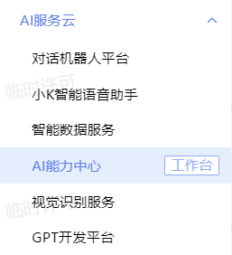
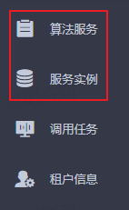
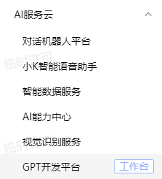
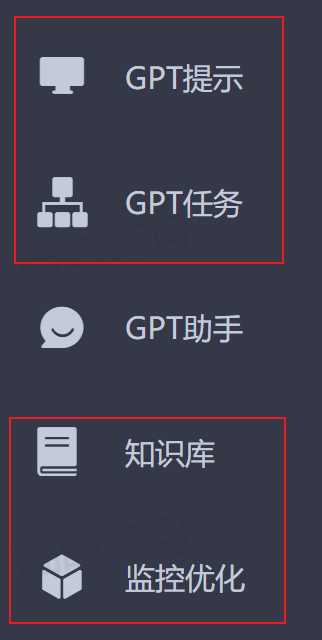
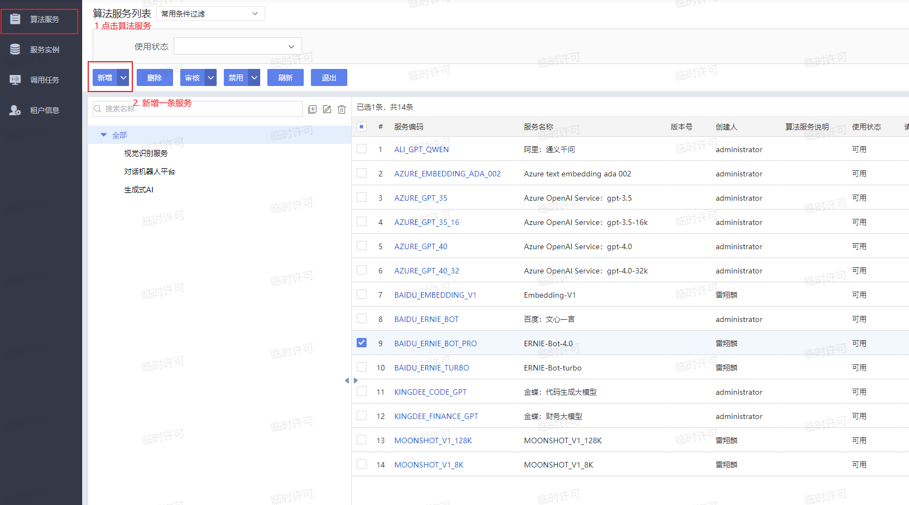
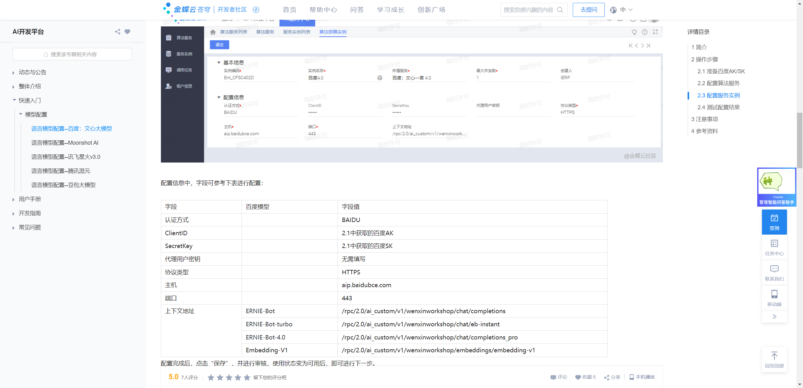
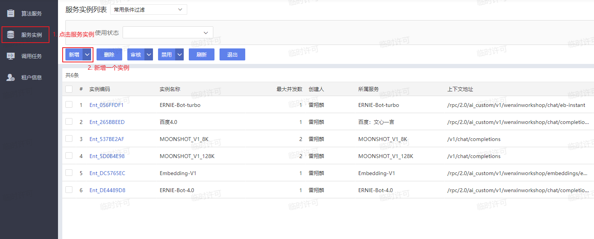
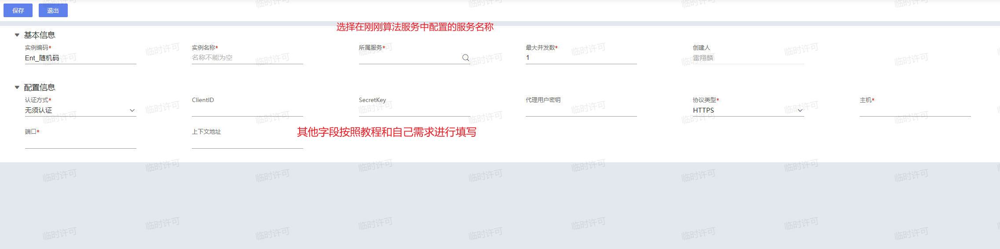

# Cosmic总览

## Cosmic相关平台

Cosmic的相关配置在AI服务云中的AI能力中心。

相关功能在AI服务云当中的GPT开发平台。

相关的Cosmic配置都在这个工作台里完成，其中经常用到的部件有GPT提示，GPT任务，知识库，监控优化。

## Cosmic配置教学

1. 首先配置算法服务
2. 再配置服务实例

首先来到AI能力中心的算法服务部分。

在新增表单中，完成对应服务规则的配置，配置内容参见[教程](https://vip.kingdee.com/knowledge/specialDetail/503950377327157504?category=528636957300429824&productLineId=29&lang=zh-CN)或者[教程2](https://www.yuque.com/waynezhonzhongweichun/hwgbgh/qd0lsbsezikkckd6)，我们可以在这个文档中获取相关的配置信息。

复制了相关配置信息之后来到服务实例中配置GPT服务。

## Cosmic功能介绍

- GPT提示

> GPT提示是用来配置GPT提示词的平台。所谓GPT提示词，就是在让GPT完成特定任务前，对它进行的一些预先配置，用户可以通过这些配置，让GPT输出用户所需的文字或者代码。

- GPT任务

> GPT任务是用来完成GPT特定任务的平台。一个任务通常由多个GPT提示词以及多个用户自定义插件行为组成，通过人的代码编写逻辑与GPT的智能相互配合，能够达到将复杂任务分解的效果，从而能够轻松地实现复杂的功能。

- 知识库

> 当完成一个复杂的功能需要GPT有丰富的知识储备时，即可将相关信息提前存储在知识库中进行使用。例如，让GPT为一本书籍进行出题的时候，如果将该本书的所有信息存储在知识库中，那么GPT将会对整本书的有一个全局的把握，出题质量将会得到很大的提高。

- 监控优化

> 在监控优化平台中记录着之前所有GPT的相关输出以及错误信息。这里能够清晰地为用户展示历史信息和错误码，能够帮助开发者高效地开发产品的AI功能。

这些平台的具体用法会在后面的章节中通过示例的形式展现给大家。