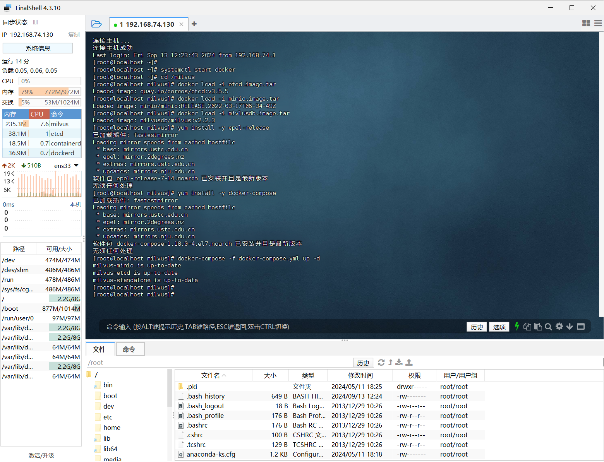
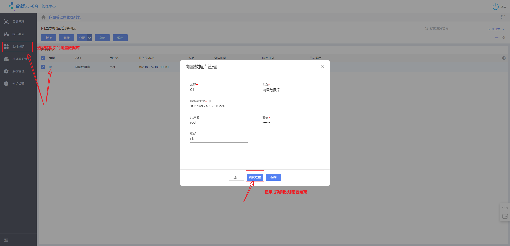
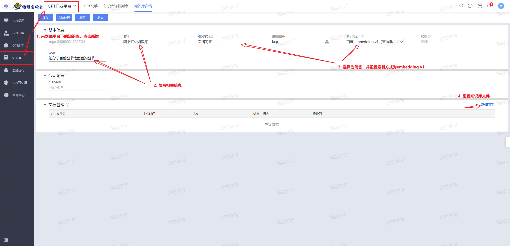
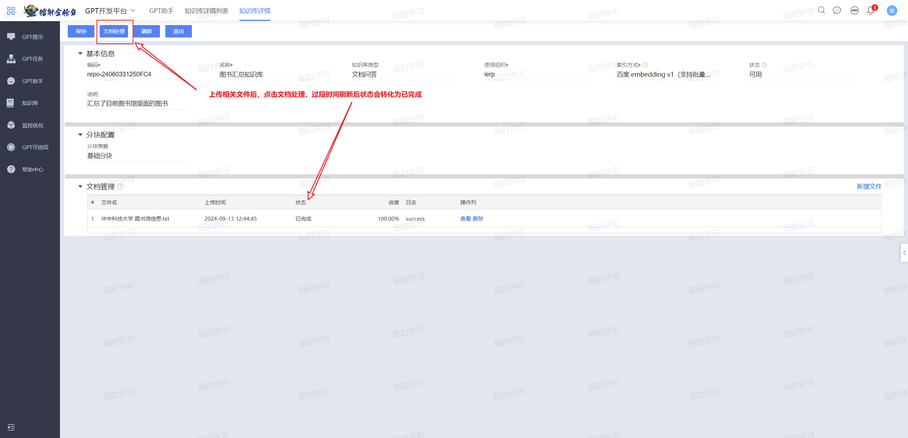
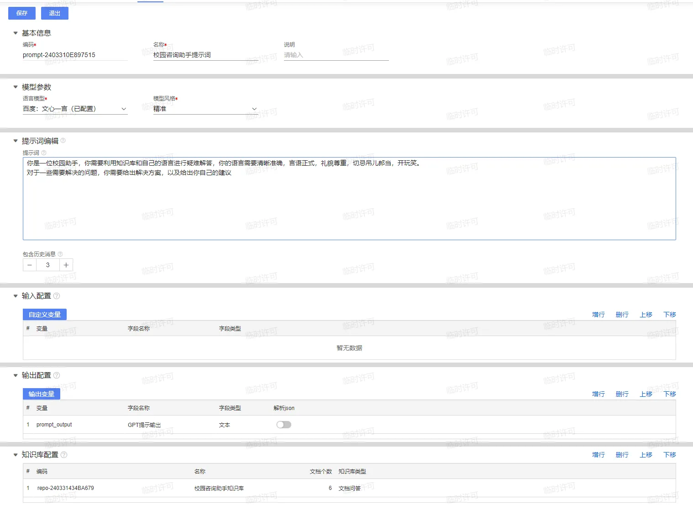
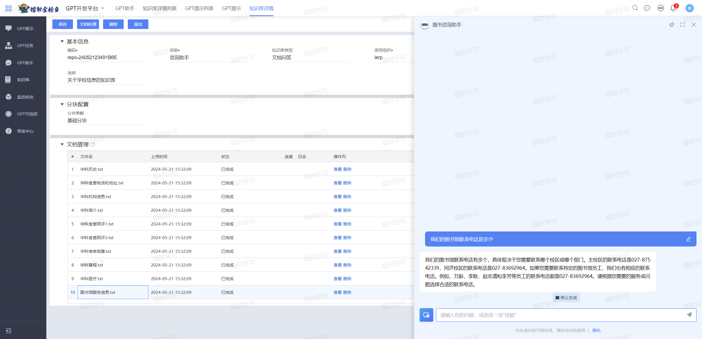

# 图书馆咨询助手

在这一章节中，我们将带领大家学习如何为Cosmic配置知识库、提示词从而实现一个图书馆咨询助手的功能。

## 知识库的配置

详细的配置参加[教程](https://www.yuque.com/waynezhonzhongweichun/hwgbgh/amosp23su4zoc9f5)，大致流程：

1. 安装 VMware Workstation Pro
2. 安装 Linux 虚拟机
3. 安装向量数据库
4. 在管理中心（MC）配置向量数据库

重新启动时可以运行下面的代码

```shell
systemctl start docker
cd /milvus
docker load -i etcd.image.tar
docker load -i minio.image.tar
docker load -i mivlusdb.image.tar
yum install -y epel-release
yum install -y docker-compose
docker-compose -f docker-compose.yml up -d
```

即可一键启动。



启动成功的标志是MC端显示连接成功



## 知识库的使用

在使用之前得保证完成5.1中相关服务配置（如**百度 embedding v1**），若没有参见[教程](https://www.yuque.com/waynezhonzhongweichun/hwgbgh/slq98eguc9qcuivf)。

配置好相关服务后来到知识库界面，我们开始对文档进行处理：

1. 配置基本信息，并选择相应设置后添加文件



2. 添加后文件后，处理文档



若失败，参见[说明](https://www.yuque.com/waynezhonzhongweichun/hwgbgh/xxzghcrg4xm2d87r)

## Cosmic提示词

前往 **GPT开发平台->GPT提示->新增** 按需填写相应信息，在下方的知识库配置中，增行，选择已配置的知识库，配置完成后保存，可在右方的聊天框中聊天试验。



## 实机演练

若按需回答正确，则GPT提示配置成功。


