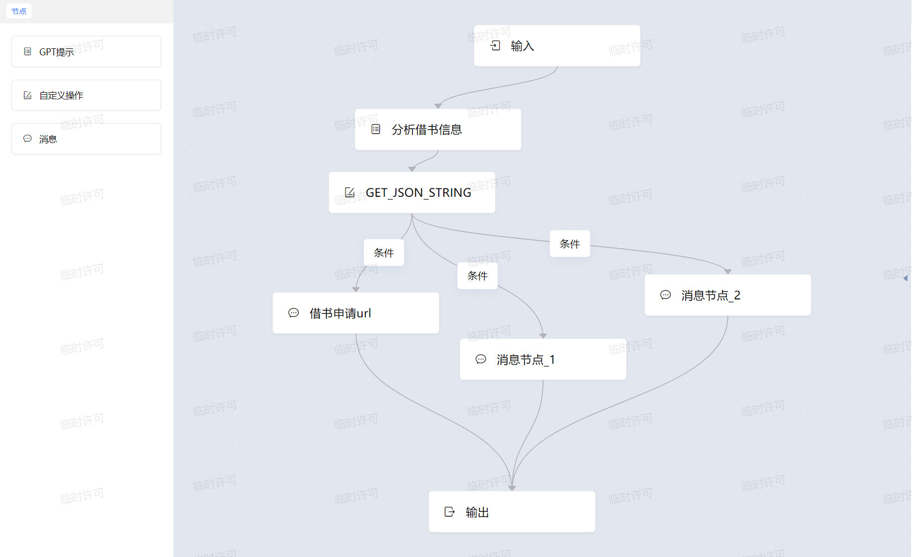
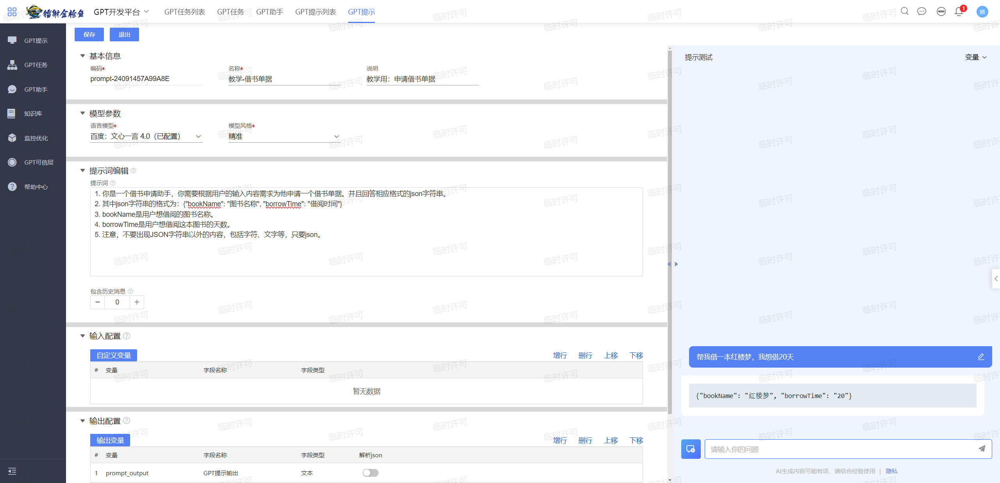
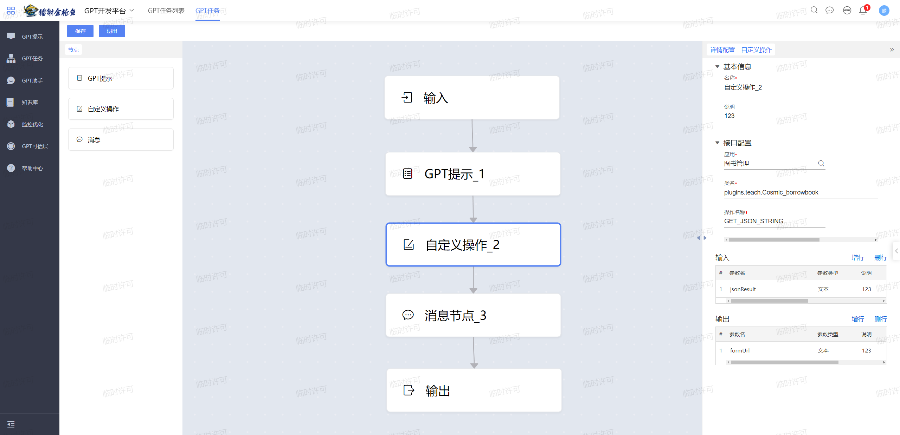
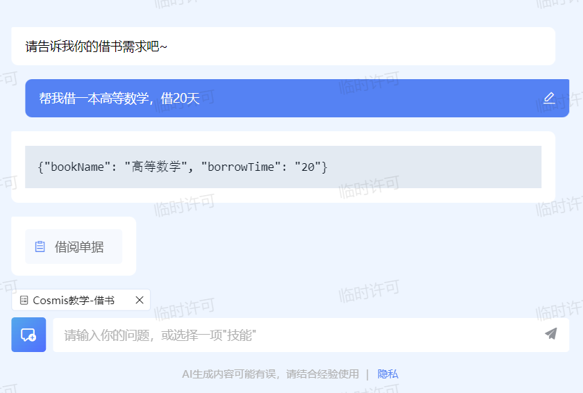
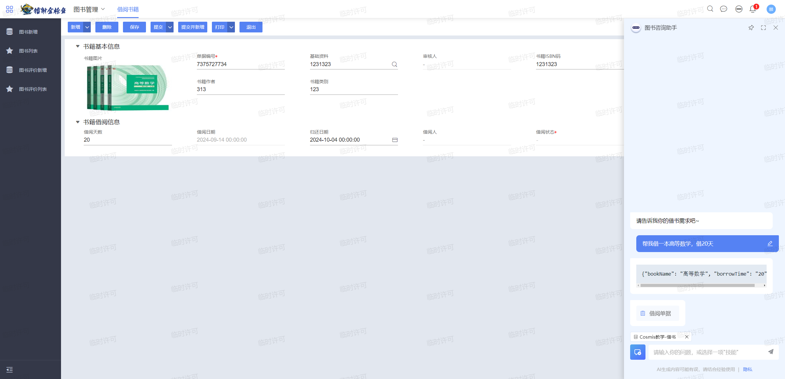

# 借书助手

## 任务目的

用户给Cosmic发送一个借书申请，包括借书书名以及借书时间，让Cosmic自动为我们生成借书单据。

借书助手的设计流程：

1. ==构思==GPT任务的大致流程（设计GPT提示、自定义插件、消息节点都在哪一步进行）。
2. 完成GPT提示的编写，在借书助手中可以把用户的需求整合成==JSON格式==再传给下一个节点。
3. 完成自定义插件的编写，根据GPT提示提供的JSON==提取出书名，日期==等信息，然后再生成==借书链接==。
4. 将链接给GPT任务中的消息节点（超链接形式），生成借书单据链接。
5. 把以上所有内容进行整合，填入到GPT任务中，即可实现借书助手。

## Cosmic任务是什么

首先来到GPT任务配置工作台，在这里我可以将任务拆解一个个小步骤，从而实现一些复杂的业务工作。



- GPT提示可以根据用户的输入生成对应的JSON或者文字信息给下一个节点。
- 自定义操作中可以插入用户自己编写的代码，从而对苍穹中的相关数据进行操作。
- 消息可以输出自定义消息，也可以输出超链接、图片、IFRAME等信息。

- 条件相当于一个if-else分支，根据上一个节点的输出来决定下一个节点的走向（进阶用法）。

## Cosmic的提示词配置

在构思完上述的GPT任务流程之后，我们就可以开始编写GPT提示词了。

这一步的目的是根据用户的输出来提炼出借书信息的JSON借书信息。



配置对应的提示词

> 1. 你是一个借书申请助手，你需要根据用户的输入内容需求为他申请一个借书单据。并且回答相应格式的json字符串。
> 2. 其中json字符串的格式为：{"bookName": "图书名称", "duringDays": "借阅时间"}
> 3. bookName是用户想借阅的图书名称。
> 4. borrowTime是用户想借阅这本图书的天数。
> 5. 注意，不要出现JSON字符串以外的内容，包括字符、文字等，只要json。

## 插件的编写

在GPT任务中的自定义操作的插件编写模板

```java
public class yourPluginName implements IGPTAction { // 注意：这里implements是IGPTAction
    @Override
    public Map<String, String> invokeAction(String action, Map<String, String> params) { // 固定写法
        Map<String , String> result = new HashMap<>(); // 固定写法
        if ("你的操作名称".equalsIgnoreCase(action)) {
            // 进行对应的操作
            // 然后将处理好的信息，塞入指定字段
            result.put("字段", 处理后的信息);
        }
        return result;
    }
}
```

利用这个模板我们编写出这次借书单据的插件。

```java
import com.alibaba.fastjson.JSON;
import com.alibaba.fastjson.JSONObject;
import kd.bos.dataentity.entity.DynamicObject;
import kd.bos.form.gpt.IGPTAction;
import kd.bos.orm.query.QCP;
import kd.bos.orm.query.QFilter;
import kd.bos.servicehelper.BusinessDataServiceHelper;
import kd.bos.servicehelper.operation.SaveServiceHelper;

import java.sql.Date;
import java.time.LocalDate;
import java.util.HashMap;
import java.util.Map;

/**
 * 动态表单插件
 */
public class Cosmic_borrowbook implements IGPTAction {
    @Override
    public Map<String, String> invokeAction(String action, Map<String, String> params) {
        Map<String, String> result = new HashMap<>();
        if ("GET_JSON_STRING".equalsIgnoreCase(action)) {
            // 获取Json字符串
            String jsonResult = params.get("jsonResult").replaceAll("\\s*|\r|\n|\t", "");
            JSONObject resultJsonObject = null;
            try {
                resultJsonObject = JSON.parseObject(jsonResult);
            } catch (Exception ee) {
                jsonResult = jsonResult.substring(jsonResult.indexOf("\"bookName\"") - 1, jsonResult.indexOf("}") + 1);
                resultJsonObject = JSON.parseObject(jsonResult);
            }
            System.out.println("resultJsonObject: " + resultJsonObject);

            // 随机一个单据编号
            StringBuilder sb1 = new StringBuilder();
            for (int i = 1; i <= 10; ++i) {
                int ascii = 48 + (int) (Math.random() * 9);
                char c = (char) ascii;
                sb1.append(c);
            }

            // 提炼出json信息
            String bookName = resultJsonObject.getString("bookName");
            String borrowTime = resultJsonObject.getString("borrowTime");

            // 筛出该图书的基础资料，方便后续set到借书单据中
            QFilter qFilter = new QFilter("name", QCP.equals, bookName);
            DynamicObject book = BusinessDataServiceHelper.loadSingle("myg6_book", new QFilter[]{qFilter});

            // 获取该书籍的对应信息
            String myg6_picture = book.getString("myg6_picturefield");
            String myg6_isbn = book.getString("number");
            String myg6_name = book.getString("name");
            String myg6_author = book.getString("myg6_author");
            String myg6_type = book.getString("myg6_type");

            // 获取当前日期
            LocalDate today = LocalDate.now();
            long daysToAdd = Long.parseLong(borrowTime);
            LocalDate returnDay = today.plusDays(daysToAdd);
            Date todayDate = Date.valueOf(today);
            Date ReturnDay = Date.valueOf(returnDay);

            // new 一个 DynamicObject 表单对象
            DynamicObject dynamicObject = BusinessDataServiceHelper.newDynamicObject("myg6_borrowbook");

            // 设置对应属性
            dynamicObject.set("billno", sb1.toString());
            dynamicObject.set("myg6_basedatafield", book);
            dynamicObject.set("myg6_picture", myg6_picture);
            dynamicObject.set("myg6_isbn", myg6_isbn);
            dynamicObject.set("myg6_name", myg6_name);
            dynamicObject.set("myg6_author", myg6_author);
            dynamicObject.set("myg6_type", myg6_type);
            dynamicObject.set("myg6_day", borrowTime);
            dynamicObject.set("createtime", todayDate);
            dynamicObject.set("myg6_endtime", ReturnDay);

            SaveServiceHelper.saveOperate("myg6_borrowbook", new DynamicObject[]{dynamicObject}, null);
            Long pkId = (Long) dynamicObject.getPkValue();
            // 拼接URL字符串
            String targetForm = "bizAction://currentPage?gaiShow=1&selectedProcessNumber=processNumber&gaiAction=showBillForm&gaiParams={\"appId\":\"myg6_booksmanage\",\"billFormId\":\"myg6_borrowbook\",\"billPkId\":\"" + pkId + "\"}&title=借阅单据 &iconType=bill&method=bizAction";
            result.put("formUrl", targetForm);
        }
        return result;
    }
}
```

## Cosmic任务配置



## 实机演示

给Cosmic发出借书申请



打开单据界面

