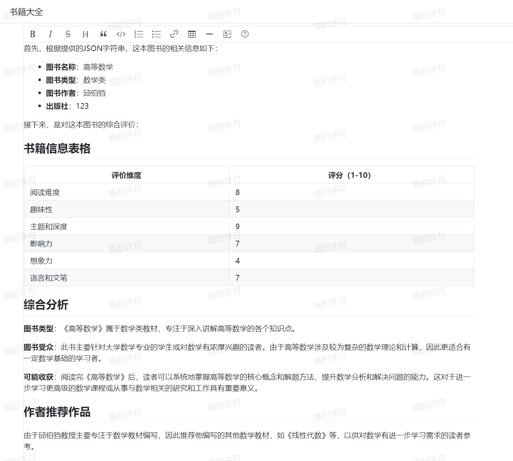

# 按钮Cosmic

## 任务目的

在这一小节中我们讲介绍如何在表单内，通过按钮点击的方式调用Cosmic，并让Cosmic对本界面的书籍进行分析，并把分析的输出展现在页面内的Markdown控件中。

实现思路：

1. 在界面内创建一个按钮，可以是工具栏按钮，也可以是控件（标签，图片，开关等）对应的点击事件。
2. 在界面内，创建一个不可见的txt控件和一个可见Markdown控件，用来后面书写插件时的相互配合。

3. 在Idea编写插件，实现对按钮的监听，并编写点击后调用Cosmic的代码逻辑。

## 苍穹界面的配置

按钮 -> 高级容器 -> txt文本（设置为不可见）-> markdown（模式选为预览）


## Cosmic提示词配置

首先我们需要明确，我们要分析这个图书什么的内容。

根据表单中的信息，我们可以让Cosmic根据这本图书的书名，作者，类别，出版社来进行分析。


我们根据上一小节所学的知识，可以这么来配置提示词：

> 1. 你需要根据以下的JSON字符串评价图书。
> 2. JSON字符串为：{{bookInfo}}
> 3. 语言清晰详细，不要有别的无关多余的语言
> 4.  其中bookName是图书名称，bookType是图书类型，bookAuthor是图书作者，bookPublisher是图书出版社
> 5. 你的回答请用Markdown的格式告诉我。
> 6. 首先陈述一遍这本书的图书名称，图书类型，图书作者，出版社
> 7. 根据上面这信息告诉我以markdown表格的格式告诉我这些信息:1.阅读难度;2.趣味性;3.主题和深度;4.影响力;5.想象力;6.语言和文笔(都在1-10内)
> 8. 再需要你结合图书名称，图书类型，图书作者，图书出版社，来综合分析这本书。分析的内容大致包含图书的类型，图书的受众，阅读完图书的可能得到的收获等等，尽量全面综合。
> 9. 最后如果有作者的话，请给我们推荐这个作者相关的一些作品进行阅读
> 10. 然后推荐这个图书类型的其他类似书籍给我们

## 插件的编写

按钮Cosmic的模板如下：

```java
public class your_fun_name extends XXXX(你选择的) implements Plugin {
    @Override
    public void registerListener(EventObject e) {
        // 注册点击事件，选择注册工具栏，控件也可行
        super.registerListener(e);
        this.addItemClickListeners("tbmain");
    }

    public void itemClick(ItemClickEvent e) {
        super.itemClick(e);
        if (e.getItemKey().equalsIgnoreCase("按钮标识名称")) {
            // ...处理...
			
            // 调用GPT开发平台微服务
            Map<String, String> variableMap = new HashMap<>();
            variableMap.put("相关标识", 处理结果);

            Object[] params = new Object[]{
                    //GPT提示编码
                    getPromptFid("提示词id"),
                    "你对它的输入",
                    variableMap
            };
            Map<String, Object> result = DispatchServiceHelper.invokeBizService("ai", "gai", "GaiPromptService", "syncCall", params); // 固定写法
            JSONObject jsonObjectResult = new JSONObject(result); // 固定写法
            JSONObject jsonObjectData = jsonObjectResult.getJSONObject("data"); // 固定写法
            // 设置值
            this.getModel().setValue("txt标识", jsonObjectData.getString("llmValue")); // llmValue是固定的写法
            Markdown mk = this.getView().getControl("md标识");
            mk.setText(jsonObjectData.getString("llmValue"));
        }
    }

    // 获取GPT提示的Fid（固定函数）
    public long getPromptFid(String billNo) {
        DynamicObject dynamicObject = BusinessDataServiceHelper.loadSingle("gai_prompt",
                "number," + "id",
                (new QFilter("number", QCP.equals, billNo)).toArray());
        return (dynamicObject).getLong("id");
    }

    @Override
    public void afterBindData(EventObject eventObject) {
        Markdown mk = this.getView().getControl("md标识");
        mk.setText(this.getModel().getValue("txt标识").toString());
    }
}
```

那么在这次案例讲解中的代码如下：

```java
import kd.bos.bill.AbstractBillPlugIn;
import kd.sdk.plugin.Plugin;
import com.alibaba.fastjson.JSON;
import com.alibaba.fastjson.JSONArray;
import com.alibaba.fastjson.JSONObject;
import kd.bos.dataentity.entity.DynamicObjectCollection;
import kd.bos.entity.IFrameMessage;
import kd.bos.ext.form.control.Markdown;
import kd.bos.form.control.IFrame;
import kd.bos.form.control.events.ItemClickEvent;
import kd.bos.form.plugin.AbstractFormPlugin;
import kd.bos.orm.query.QCP;
import kd.bos.orm.query.QFilter;
import kd.bos.servicehelper.BusinessDataServiceHelper;
import kd.bos.servicehelper.DispatchServiceHelper;
import kd.sdk.plugin.Plugin;
import kd.bos.dataentity.entity.DynamicObject;

import java.util.EventObject;
import java.util.HashMap;
import java.util.Map;
/**
 * 单据界面插件
 */
public class buttom_Gpt_evaluate extends AbstractBillPlugIn implements Plugin {
    @Override
    public void registerListener(EventObject e) {
        // 注册点击事件
        super.registerListener(e);
        this.addItemClickListeners("tbmain");
    }

    public void itemClick(ItemClickEvent e) {
        super.itemClick(e);
        if (e.getItemKey().equalsIgnoreCase("myg6_book_anal")) {
            // 获取日任务信息，并且以JSON字符串的形式展现
            JSONObject jsonResultObject = new JSONObject();
            jsonResultObject.put("bookName", this.getModel().getValue("name").toString());
            jsonResultObject.put("bookAuthor", this.getModel().getValue("myg6_author").toString());
            jsonResultObject.put("bookType", this.getModel().getValue("myg6_type").toString());
            jsonResultObject.put("bookPublisher", this.getModel().getValue("myg6_press").toString());

            // 调用GPT开发平台微服务
            Map<String, String> variableMap = new HashMap<>();
            variableMap.put("bookInfo", jsonResultObject.toJSONString());

            Object[] params = new Object[]{
                    //GPT提示编码
                    getPromptFid("prompt-240915C6840AD3"),
                    "开始分析这本图书",
                    variableMap
            };
            Map<String, Object> result = DispatchServiceHelper.invokeBizService("ai", "gai", "GaiPromptService", "syncCall", params);
            JSONObject jsonObjectResult = new JSONObject(result);
            JSONObject jsonObjectData = jsonObjectResult.getJSONObject("data");
            // 设置值
            this.getModel().setValue("myg6_txt", jsonObjectData.getString("llmValue"));
            Markdown mk = this.getView().getControl("myg6_md");
            mk.setText(jsonObjectData.getString("llmValue"));
        }
    }

    // 获取GPT提示的Fid
    public long getPromptFid(String billNo) {
        DynamicObject dynamicObject = BusinessDataServiceHelper.loadSingle("gai_prompt",
                "number," + "id",
                (new QFilter("number", QCP.equals, billNo)).toArray());
        return (dynamicObject).getLong("id");
    }

    @Override
    public void afterBindData(EventObject eventObject) {
        Markdown mk = this.getView().getControl("myg6_md");
        mk.setText(this.getModel().getValue("myg6_txt").toString());
    }
}
```

## 实机演示



## 改进空间

思考：我们如何让Cosmic能够更完整详细地分析这本书呢？

答：我们可以为该提示词配置知识库内容，知识库中详细地包含所有图书的相关详细信息。