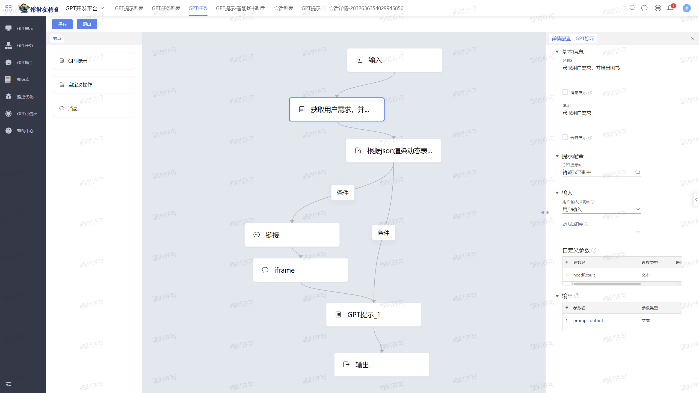
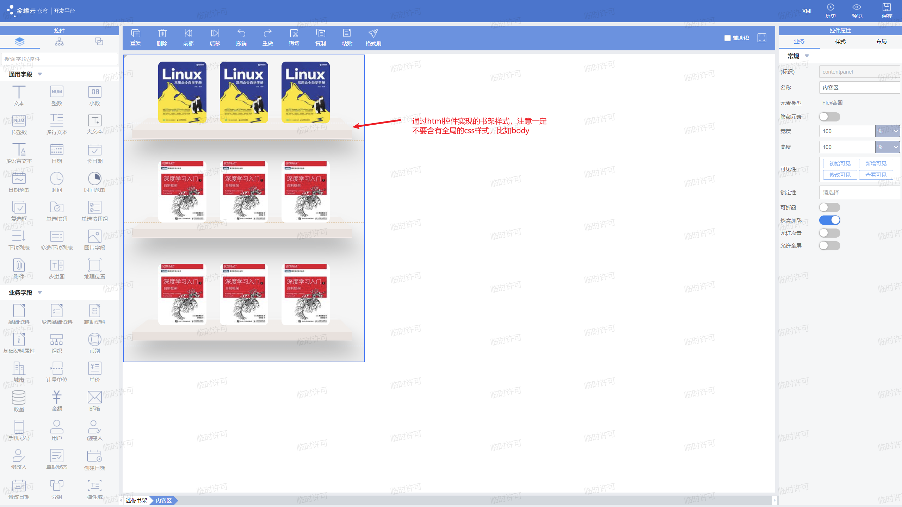
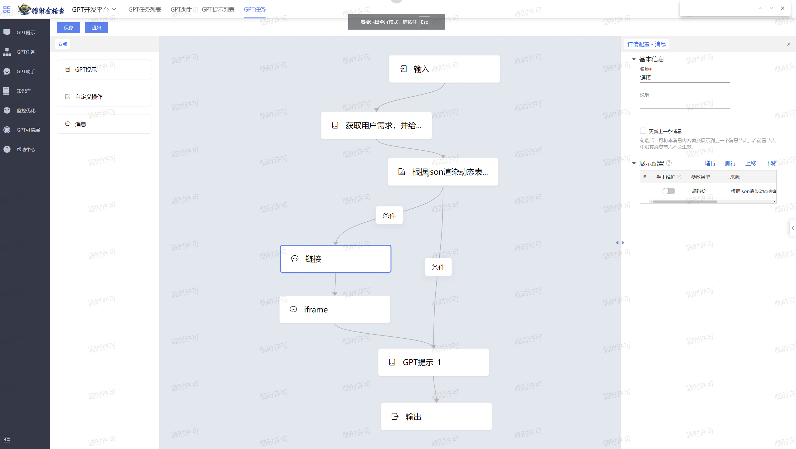
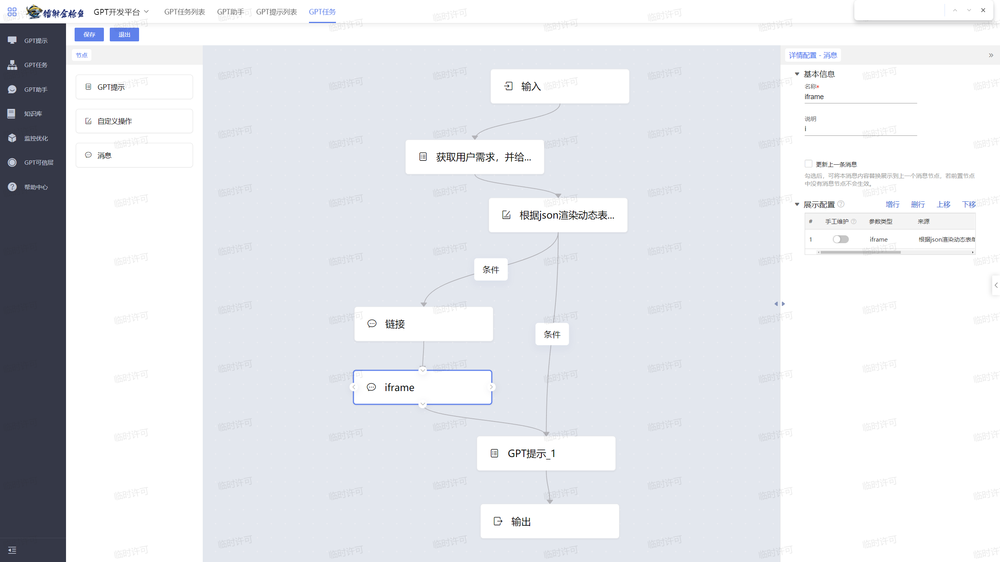

# AI搜索

## 导言

我们在第三章中实现了一个搜索框功能，效果如下图所示：


怎么运用苍穹GPT丰富这个功能呢？目前这个功能只能实现书名的检索，假如用户记不清书名，或者书名记错了，可能就没法找到他想要的资源了。而且我们也经常能看到有的人在网上问“有一本书的内容是xxxxxxx，请问这是哪本书？”。针对这些情况，我们可以设计一个AI功能，实现图书的智能检索，让用户能够完成书籍的模糊搜索。

## 本节目标

我们想要实现的最终效果是这样的，首先，在搜索框下面增加一个开关，如果开关打开则进入智能搜索。

****

在智能搜索的流程中，我们首先通过GPT提示词，对用户输入的内容进行解析，并根据图书库的内容匹配书籍。因为符合关键词的书籍可能有很多本，我们可以在提示词中做数量的限制。

怎样向用户展示这些匹配到的书籍呢？当然可以直接通过文本的形式展示，但是为了让这个功能更加有特色，用户体验更好，我们可以通过一个迷你书架展示给用户，并为里面的图书添加点击事件，使得用户点击图书，即可跳转到这本书的单据详情界面。像下面这样：


这个要怎么实现呢？可以通过动态表单来实现，我们本节教学内容的重点就在这一部分。

最后我们还要像用户解释推荐这些书的原因，如果没有符合要求的书，也要向用户说明情况。


根据之前学习的内容，我们可以通过配置GPT任务，实现将GPT提示、自定义操作以及消息节点编排在一起，并在侧边栏中或插件中使用。



## 实现步骤

### 一、配置提示词与GPT任务

- 首先通过GPT提示词，将需求提供给GPT，GPT将生成包含推荐图书数量与书名的`json`格式字符串。

```txt
## 你是一个智能找书助手，你需要根据图书库中已有的图书，和用户找书的需求来返回满足图书的书名
## 图书馆的藏书内容如下：
{
B000001	高等数学1
B000002	游戏学导论
......												//可以直接配置成提示词，也可以用插件获取图书库内容，如果想要更精准的结果，												    //可以把书名和其内容简介配置成知识库
}
## 其中json字符串的格式为：{"bookList": 图书库里面已有的图书, "userNeed": 用户所提的需求}
## 在以上JSON字符串中，bookList是我们图书库里面已有的图书，userNeed是用户的相关需求
## 最后给我一个满足的图书集合，要求最多九本书
类似：jsonResult:{"cnt":满足的图书本数,"book1":XXX,"book2":XXX...}
## 注意，不要出现JSON字符串以外的内容，包括字符、文字等。
## example：										//经测试，给GPT提供例子会增加输出的准确性。
user：我想看热门的书籍。
you：{
"cnt":9
"book1":"红楼梦"
"book2":"百年孤独"
"book3":"活着"
"book4":"1984"
"book5":"白夜行"
"book6":"房思琪的初恋乐园"
"book7":"飘"
"book8":"动物农场"
"book9":"白鹿原"
}
```

- 然后解析json字符串中的图书数量，如果不为0，则将这些书渲染到一个动态表单里，动态表单如下所示：

  ```java
  public class SearchPluginMid7 implements IGPTAction {
      @Override
      public Map<String, String> invokeAction(String action, Map<String, String> params) {
          Map<String, String> result = new HashMap<>();
          if ("GET_JSON_STRING".equalsIgnoreCase(action)) {
              // 将无效字符进行处理
              String jsonResult = params.get("needResult").replaceAll("\\s*|\r|\n|\t", "");
  
              JSONObject resultJsonObject = JSON.parseObject(jsonResult);
              // 创立一个String 变长数组 bookNames
              //List<String> bookNames = new ArrayList<>();
              // 遍历resultJsonObject的TaskList数组
              String cnt_str = resultJsonObject.get("cnt").toString();
              int cnt = Integer.parseInt(cnt_str);
  
              DistributeSessionlessCache cache = CacheFactory.getCommonCacheFactory().getDistributeSessionlessCache("customRegion");
  
              for (int i = 1; i <= cnt; ++i) {
                  cache.put("bookSearch" + i, resultJsonObject.getString("book" + i));
              }
  
              cache.put("bookSearchCnt", "" + cnt);
  
              String property = System.getProperty("domain.contextUrl");
              String url = property + "/index.html?formId=myg6_minishelf";
              result.put("formUrl", url);
              result.put("cnt", cnt + "");
              result.put("anatext", params.get("request").replaceAll("\\s*|\r|\n|\t", "") + params.get("needResult").replaceAll("\\s*|\r|\n|\t", ""));
              cache.put("openFlag", "true");
          }
          return result;
      }
  }
  
  ```
  
  

  

- 然后我们要编写这个动态表单的插件，根据json字符串的内容，插入相应的图书封面，并进行点击事件的注册

  ```java
  public class MiniShelfRender extends AbstractFormPlugin implements Plugin {
      @Override
      public void registerListener(EventObject event) {
          super.registerListener(event);
          // 获取分布式无会话缓存
          DistributeSessionlessCache cache = CacheFactory.getCommonCacheFactory().getDistributeSessionlessCache("customRegion");
  
          // 为每个按钮添加点击监听器
          Button button1 = this.getView().getControl("myg6_image1");
          button1.addClickListener(this);
          Button button2 = this.getView().getControl("myg6_image2");
          button2.addClickListener(this);
          Button button3 = this.getView().getControl("myg6_image3");
          button3.addClickListener(this);
          Button button4 = this.getView().getControl("myg6_image4");
          button4.addClickListener(this);
          Button button5 = this.getView().getControl("myg6_image5");
          button5.addClickListener(this);
          Button button6 = this.getView().getControl("myg6_image6");
          button6.addClickListener(this);
          Button button7 = this.getView().getControl("myg6_image7");
          button7.addClickListener(this);
          Button button8 = this.getView().getControl("myg6_image8");
          button8.addClickListener(this);
          Button button9 = this.getView().getControl("myg6_image9");
          button9.addClickListener(this);
      }
  
      @Override
      public void click(EventObject evt) {
          super.click(evt);
  
          // 获取点击的控件
          Control source = (Control) evt.getSource();
          // 获取分布式无会话缓存
          DistributeSessionlessCache cache = CacheFactory.getCommonCacheFactory().getDistributeSessionlessCache("customRegion");
  
          String fields = "name";
          QFilter[] filters = new QFilter[0];
          // 加载书籍列表
          DynamicObject[] dys = BusinessDataServiceHelper.load("myg6_book_list", fields, filters);
          // 从缓存中获取书名
          String bookName = cache.get("bookSearch" + source.getKey().substring(10));
          String bookNameTrimmed = bookName.replaceAll("\\s+", "");
          QFilter qFilter = new QFilter("name", QCP.equals, bookNameTrimmed);
  
          DynamicObject single = null;
          // 查找匹配的书籍
          for (DynamicObject result : dys) {
              if (result.getString("name").replaceAll("\\s+", "").equals(bookNameTrimmed)) {
                  single = result;
                  BillShowParameter billShowParameter = new BillShowParameter();
                  billShowParameter.setFormId("myg6_book_list");
                  billShowParameter.getOpenStyle().setShowType(ShowType.Modal);
                  billShowParameter.setStatus(OperationStatus.VIEW);
                  Long pkId = (Long) single.getPkValue();
                  billShowParameter.setPkId(pkId);
                  // 显示书籍详情表单
                  this.getView().showForm(billShowParameter);
                  break;
              }
          }
      }
  
      @Override
      public void afterCreateNewData(EventObject e) {
          super.afterCreateNewData(e);
  
          // 获取分布式无会话缓存
          DistributeSessionlessCache cache = CacheFactory.getCommonCacheFactory().getDistributeSessionlessCache("customRegion");
          int cnt = Integer.parseInt(cache.get("bookSearchCnt"));
          if (cnt >= 9) {
              cnt = 9;
          }
          // 为每个按钮添加点击监听器，并根据缓存中的书籍数量设置按钮的可见性
          for (int i = 1; i <= 9; i++) {
              this.addClickListeners("myg6_image" + i);
              if (i > cnt) {
                  this.getView().setVisible(false, "myg6_image" + i);
              }
          }
          List<String> bookArray = new ArrayList<>();
          for (int i = 1; i <= cnt; i++) {
              bookArray.add(cache.get("bookSearch" + i));
          }
  
          String fields = "name,myg6_picturefield";
          QFilter[] filters = new QFilter[0];
          // 加载书籍列表
          DynamicObject[] dys = BusinessDataServiceHelper.load("myg6_book_list", fields, filters);
          int index = 0;
          // 设置每个按钮对应的图片
          for (String v : bookArray) {
              index++;
              for (DynamicObject single : dys) {
                  if (single.getString("name").replaceAll("\\s+", "").equals(v.replaceAll("\\s+", ""))) {
                      String url = single.getString("myg6_picturefield");
                      Image image = this.getView().getControl("myg6_image" + index);
                      image.setUrl("http://" + MY_IP + ":8881/ierp/attachment/downloadImage/" + url);
                      break;
                  }
              }
          }
      }
  }
  
  ```
  
- 下面我们可以用多种方式展示这个表单
  - 可以用超链接
    
  
  - 也可以用iframe的方式

    
  
  - 还可以直接在主页弹窗显示,下面是这个AI搜索功能页面的完整代码
  
  ```java
  public class SearchPlugin extends AbstractFormPlugin implements SearchEnterListener {
  
      // 搜索控件标识
      private final static String KEY_SEARCH = "myg6_searchap";
  
      @Override
      public void registerListener(EventObject e) {
          // 侦听搜索控件的搜索事件
          Search search = getView().getControl(KEY_SEARCH);
          search.addEnterListener(this);
          super.registerListener(e);
      }
  
      /**
       * 用户敲入搜索字符时，即时触发：输出模糊搜索结果
       */
      @Override
      public List<String> getSearchList(SearchEnterEvent evt) {
          Search search = (Search) evt.getSource();
          if (StringUtils.equals(KEY_SEARCH, search.getKey())) {
              String searchText = evt.getText();
              if (StringUtils.isNotBlank(searchText))
                  return this.doSearchList(searchText);
          }
          return null;
      }
      private List<String> doSearchList(String searchText) {
          // 模糊搜索结算方式
          // 构建取数条件
          String fields = "number,name";
          // Create an empty filter array (no filters)
          QFilter filter1 = new QFilter("name", QCP.like, "%" + searchText + "%");
          QFilter[] filter = new QFilter[]{filter1};
          // Load the data
          DynamicObject[] collection = BusinessDataServiceHelper.load("myg6_book_list", fields, filter);
          Map<String, String> searchList = new HashMap<String, String>();
          for (DynamicObject obj : collection) {
              searchList.put("myg6_book_list" + " " + obj.get("number").toString(), "" + obj.get("name"));
          }
          // 把本次搜索结果放到页面缓存：后续search事件要用到
          getPageCache().put("searchList", SerializationUtils.toJsonString(searchList));
          return new ArrayList<>(searchList.values());
      }
      @Override
      public void search(SearchEnterEvent evt) {
          Search search = (Search) evt.getSource();
          if (StringUtils.equals(KEY_SEARCH, search.getKey())) {
              String searchText = evt.getText();
              this.doSearch(searchText);
          }
      }
      /**
       * 实现搜索
       * @param searchText 搜索文本
       */
      private void doSearch(String searchText) {
          Boolean AI = (Boolean) this.getModel().getValue("myg6_smartsearch");
          if (AI) {
              // 呼出gpt对话框
              String pageId = this.getView().getMainView().getPageId();
              Object pkValue = getProcessFid("process-24080158231F7B");
              JSONObject needJson = new JSONObject();
              // 从数据库中获取书籍列表
              String bookList = "";
              String fields = "name";
              QFilter[] filters = new QFilter[0];
              DynamicObject[] dys = BusinessDataServiceHelper.load("myg6_book_list", fields, filters);
              for (DynamicObject dy : dys) {
                  bookList += dy.getString("name") + ",";
              }
              needJson.put("bookList", bookList);
              needJson.put("userNeed", searchText);
              DistributeSessionlessCache cache = CacheFactory.getCommonCacheFactory().getDistributeSessionlessCache("customRegion");
              cache.put("openFlag", "false");
              DispatchServiceHelper.invokeBizService("ai", "gai", "GaiService","selectProcessInSideBar",pkValue, pageId, "----------------------正在搜索----------------------\n");
              DispatchServiceHelper.invokeBizService("ai", "gai", "GaiService","startProcessInSideBar", pkValue, pageId, new HashMap(), needJson.toJSONString());
              for (int i = 1; i <= 10; ++i) {
                  try {
                      Thread.sleep(1000);
                  } catch (InterruptedException e) {
                      throw new RuntimeException(e);
                  }
                  String openFlag = cache.get("openFlag");
                  if (openFlag != null && openFlag.equals("true")) {
                      FormShowParameter formShowParameter = new FormShowParameter();
                      formShowParameter.setFormId("myg6_minishelf");
                      formShowParameter.getOpenStyle().setShowType(ShowType.Modal);
                      this.getView().showForm(formShowParameter);
                      break;
                  }
              }
          } else {
              ListShowParameter lsp = new ListShowParameter();
              lsp.setFormId("bos_list");
              lsp.setBillFormId("myg6_book_list");
              lsp.getOpenStyle().setShowType(ShowType.Modal);
              ListFilterParameter listFilterParameter = new ListFilterParameter();
              QFilter qFilter = new QFilter("name", QCP.like, "%" + searchText + "%");
              listFilterParameter.setFilter(qFilter);
              lsp.setListFilterParameter(listFilterParameter);
              this.getView().showForm(lsp);
          }
      }
  
      public Object getProcessFid(String billNo) {
          DynamicObject dynamicObject = BusinessDataServiceHelper.loadSingle("gai_process",
                  "number," +
                          "id",
                  (new QFilter("number", QCP.equals, billNo)).toArray());
          long idd = dynamicObject.getLong("id");
          return Long.parseLong(String.valueOf(idd));
      }
  }
  
  ```
  
- 最后，我们还要将结果再次交给GPT，生成解释性的话语，告诉用户推荐这些图书的原因。

### 二、增加按钮，完成页面

  


