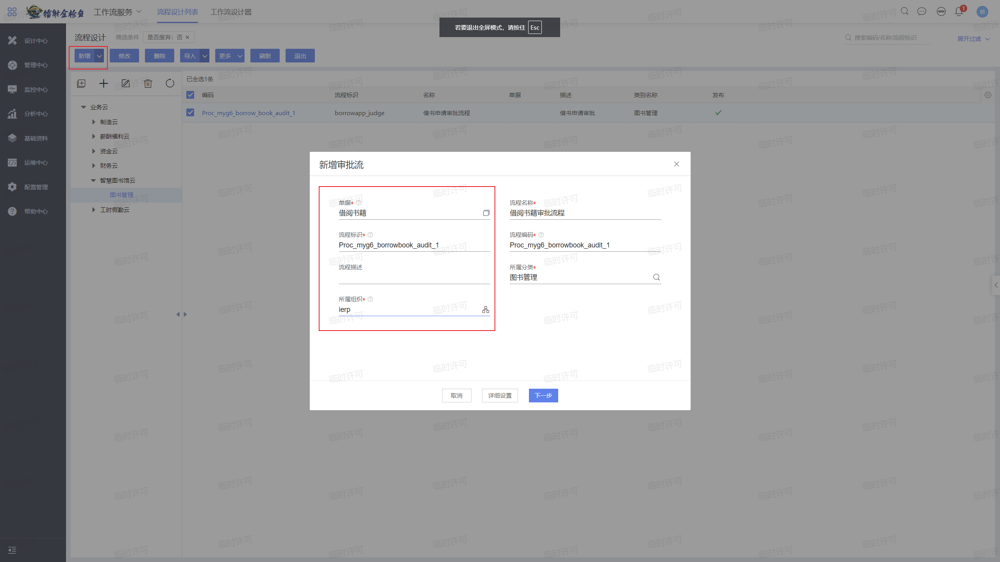
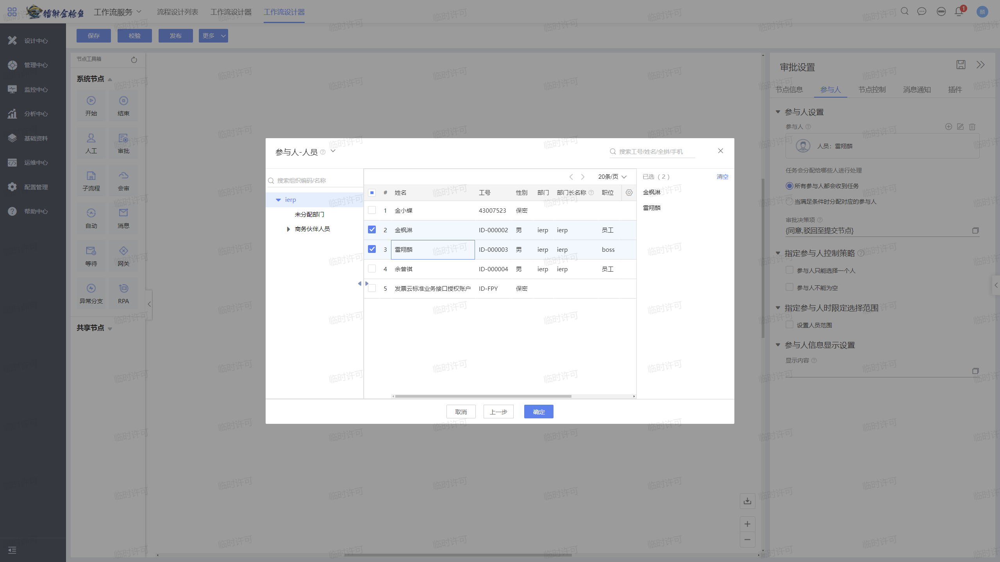

# 工作流

## 导言

我们上一章实现了书籍基础资料的单据体，并完成了借书的功能及相关插件。但是这个功能还不是很完善，用户自己提交单据，自己点击审核后，就可以成功借书了，这与实际的业务场景不符。按照现实中的场景，应该是学生提交借书申请单据后，由管理员来审批。我们今天就借助苍穹的工作流，来实现借书流程的分角色审批。

## 工作流

苍穹平台提供了强大的工作流功能，支持多种复杂的审批场景。

## 操作步骤

### 一、工作流配置

首先搜索流程设计，并选择流程设计(工作流服务)


点击左上角增加业务员，选择智慧图书馆云


点击新增，并选择对应的借书单据，然后进行相关的配置操作：



点击下一步，这里按照我们设想的业务场景，设置1级审批就可以。


然后进行工作流的详细配置，我们选择审批节点，在参与人配置处我们选择指定人员。当然也可以配置工作流角色，使人员的权限更加清晰明了。





保存并发布。注意：为了保证数据不丢失，工作流一经发布，便不可删除，只能进行版本的更新。


发布后，我们再进行借书的操作，提交单据后我们点击审核，会提示单据已在流程中流转，不能审核


我们来到首页右上角的消息中心，会发现收到了审批任务


我们可以在这里进行审批，这样就是实现了分角色的多级审批：


### 二、借书插件迁移

既然实现了多级审批，我们之前编写的借书插件也要迁移到审批节点这里。先按格式写好插件，这里只保留了改变图书状态部分，判断是否有可用图书的部分，可以绑定到单据提交操作上。

```java
package plugins.teach;

import kd.bos.dataentity.entity.DynamicObjectCollection;
import kd.bos.orm.query.QCP;
import kd.bos.orm.query.QFilter;
import kd.bos.servicehelper.BusinessDataServiceHelper;
import kd.bos.servicehelper.operation.SaveServiceHelper;
import kd.bos.workflow.api.AgentExecution;
import kd.bos.workflow.engine.extitf.IWorkflowPlugin;
import kd.bos.dataentity.entity.DynamicObject;
/**
 * 工作流插件
 */
public class Afterborrowbook implements IWorkflowPlugin {
    @Override
    public void notify(AgentExecution execution) {
        String businessKey = execution.getBusinessKey(); // 单据的BusinessKey(业务ID)
        DynamicObject fatherDynamic = BusinessDataServiceHelper.loadSingle(businessKey, "myg6_borrowbook");
        String borrowBookName = fatherDynamic.getString("myg6_name");


        String fields = "name,myg6_bookinfo,myg6_combo";
        QFilter[] filters = new QFilter[0];
        DynamicObject[] dys = BusinessDataServiceHelper.load("myg6_book", fields, filters);

        for (DynamicObject obj : dys) {
            String bookName = obj.getString("name");
            if (bookName.equals(borrowBookName)) {
                DynamicObjectCollection rows = obj.getDynamicObjectCollection("myg6_bookinfo");
                for (DynamicObject row: rows){
                    if (row.getString("myg6_combo").equals("0")) {
                        row.set("myg6_combo", "1");
                        SaveServiceHelper.update(obj);
                        break;
                    }
                }
            }
        }

        IWorkflowPlugin.super.notify(execution);
    }
}
```

点击新增并进行相关配置


这样工作流插件就也实现完毕了。
