# 单据转换

## 什么是单据转换

单据转换是指将A单据的数据根据预设的转换规则，自动生成B单据的过程。在这个过程中，会触发单据转换插件事件，允许自定义插件进行干预。通过这种方式，可以实现源单据和目标单据之间的数据转录工作，从而提高数据处理的效率和准确性。

## 本节任务

实现单据转换功能，在书籍基础资料界面点击按钮，自动生成借书单据。

## 实现步骤

### 一、单据转换配置

首先在书籍基础资料和借书单据的“业务控制”属性都启用“参与单据转换”功能，注意要确定并保存。

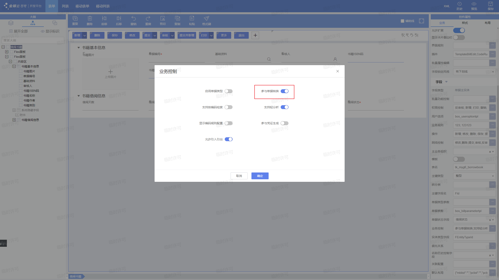

在借书单据里面进行关联配置：

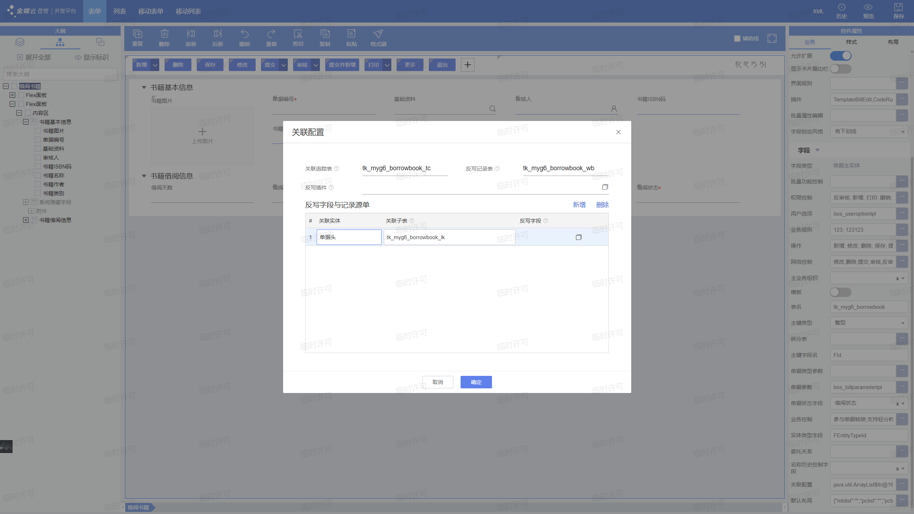

搜索转换路线

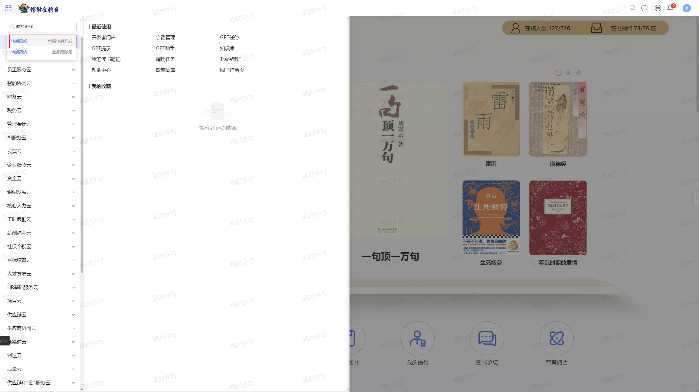

点击新增，配置源单与目标单

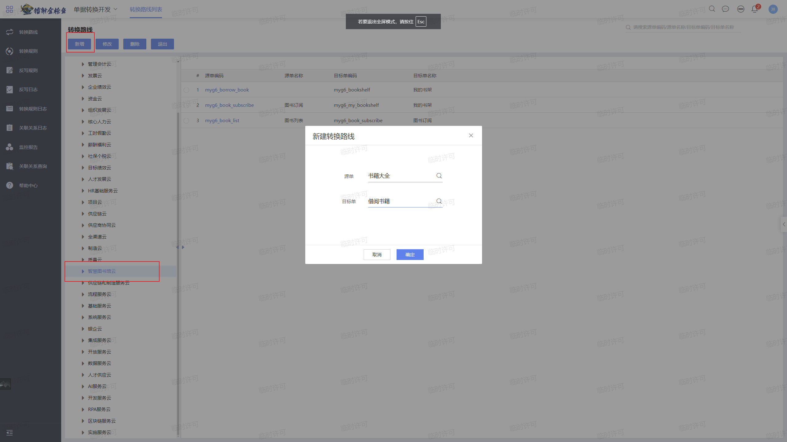

配置规则启用条件：书籍状态等于已审核

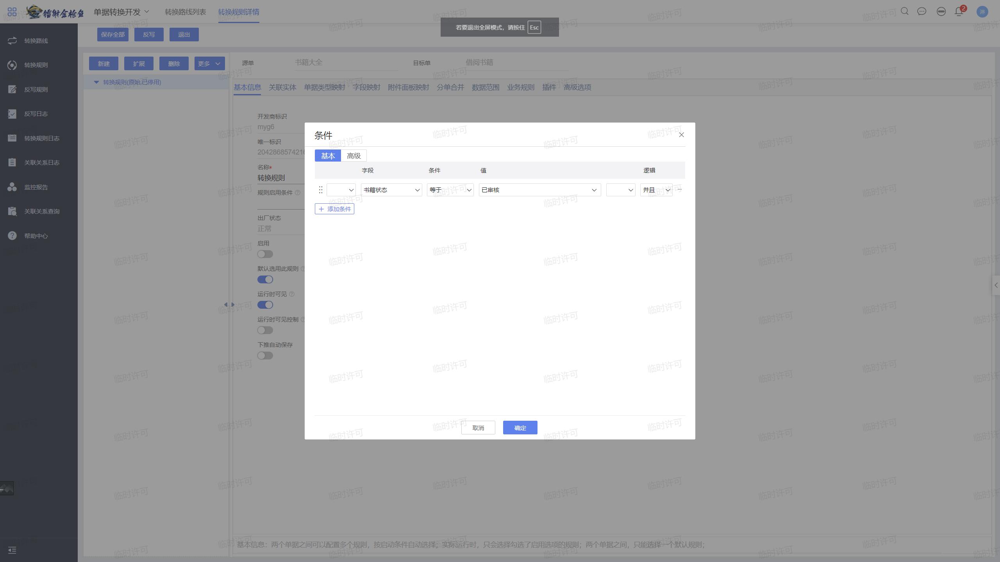

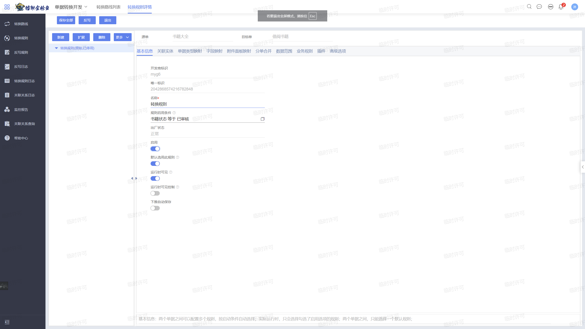

配置关联实体：

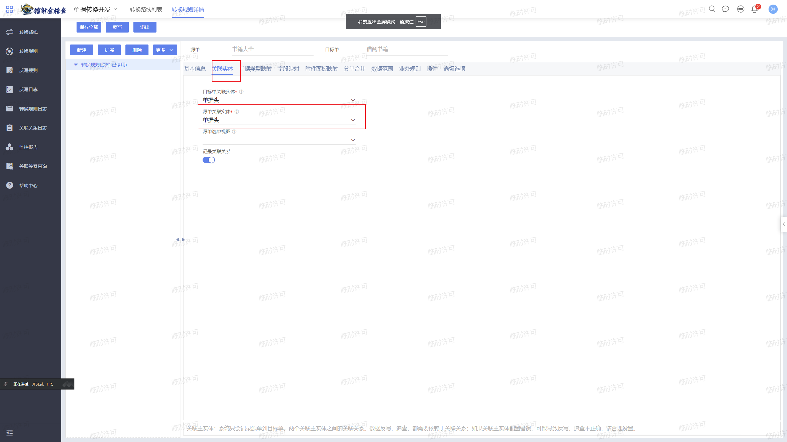

然后进行字段映射的配置：

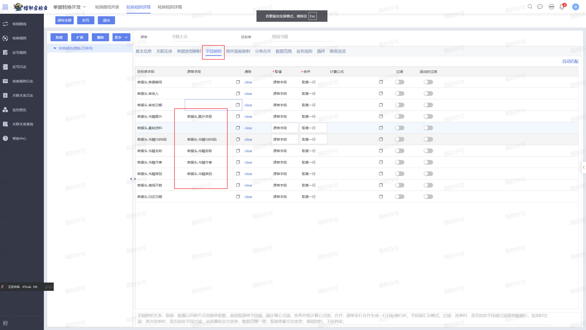

基础资料我们可通过计算公式的方法进行映射：

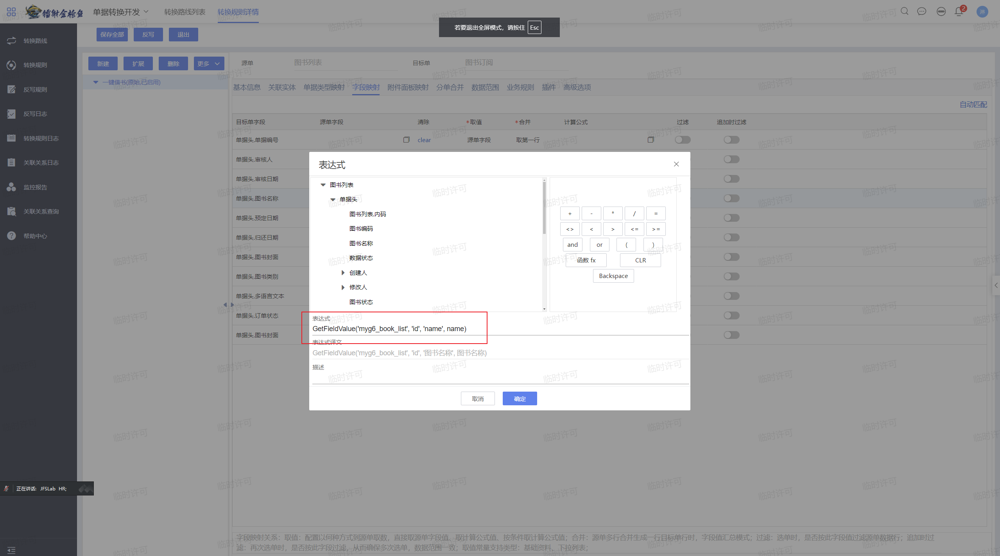

保存后就配置成功了。

### 二、添加下推按钮

首先在书籍基础资料工具栏添加按钮。

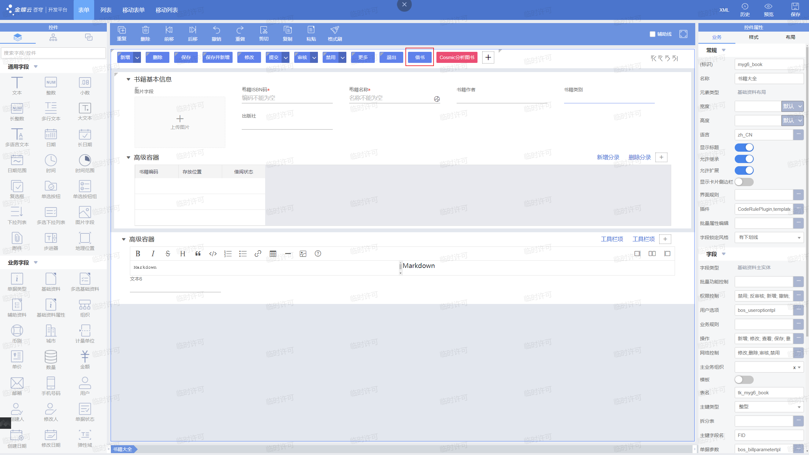

然后配置操作代码，选择下推，并进行如图所示的配置

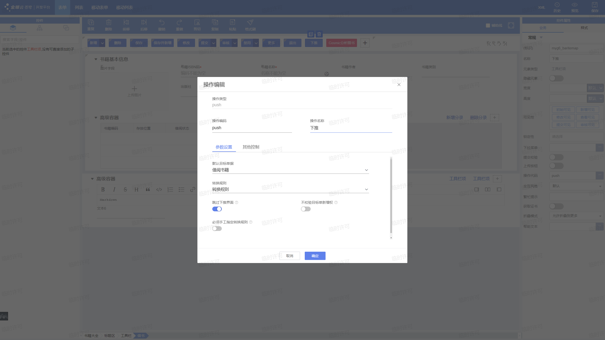

来到书籍详情界面，点击借书

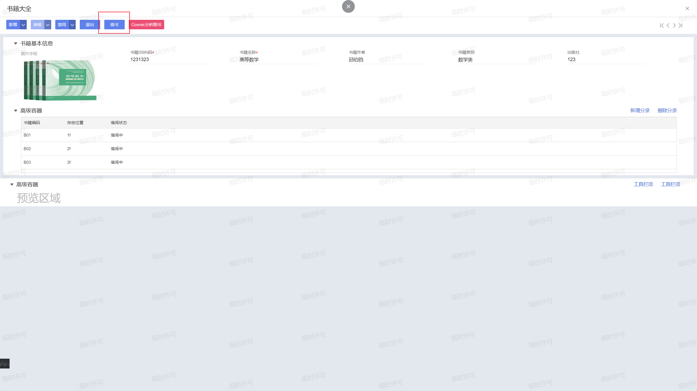

可以看到成功下推生成了借书单据：

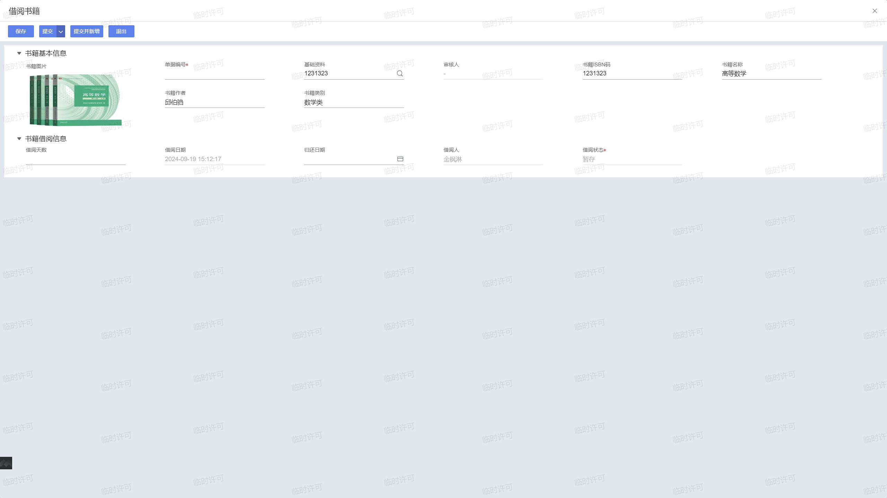
