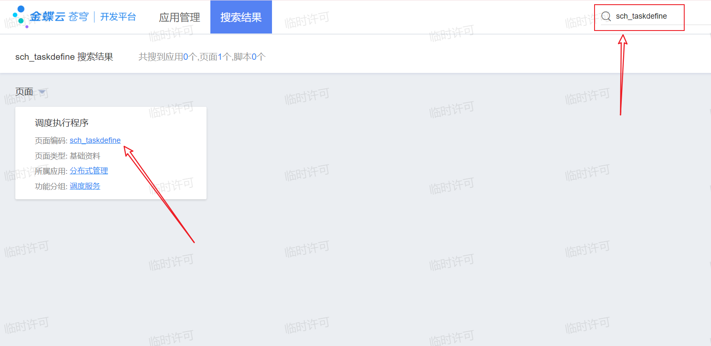
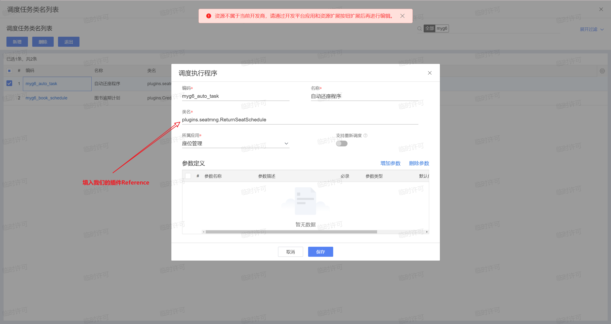
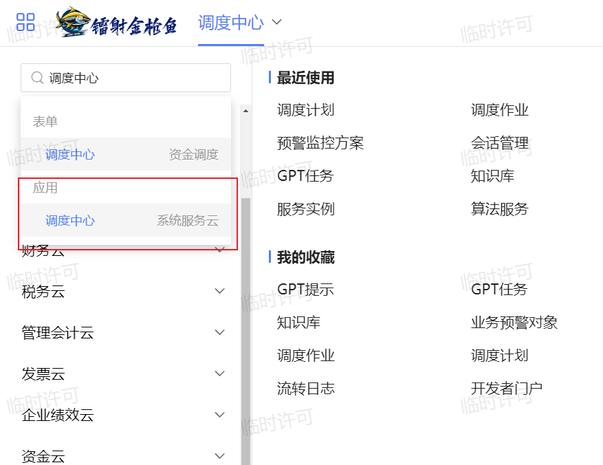
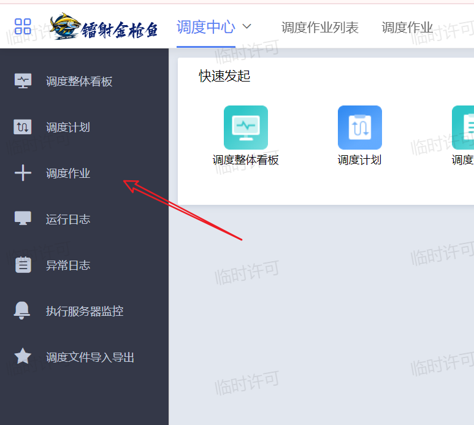
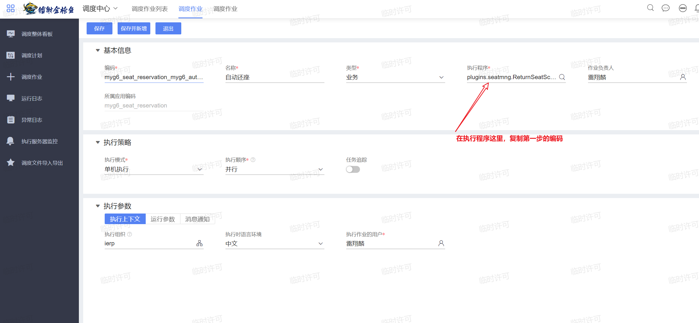
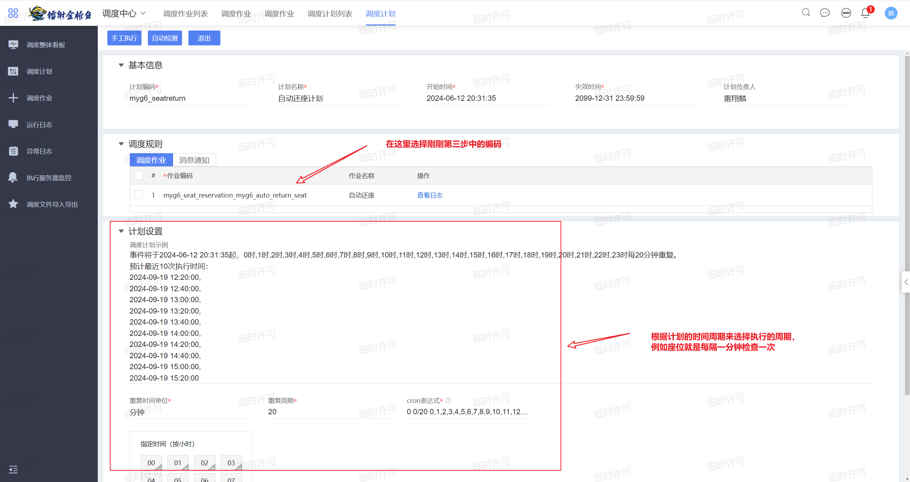
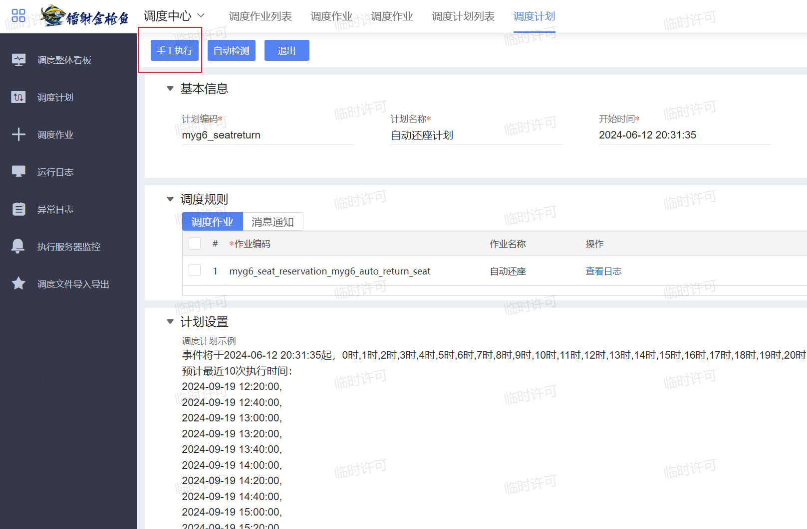

# 调度计划

> 调度计划就是让系统每隔一段时间自动执行相应逻辑的功能。

## 任务目标

使用调度计划实现一个座位自动归还计划，当预定的座位到达预定结束时间的时候，系统自动归还座位。

## 代码逻辑编写

相应的逻辑全写在`execute`函数中

模板代码：

```java
import java.util.Map;
 
import kd.bos.context.RequestContext;
import kd.bos.exception.KDException;
import kd.bos.schedule.executor.AbstractTask;
 
public class yourPluginName extends AbstractTask {
 
    @Override
    public void execute(RequestContext requestContext, Map<String, Object> map) throws KDException {
         // TODO Auto-generated method stub
    }
}
```

本小节对应代码：

```java
import com.alibaba.druid.util.StringUtils;
import kd.bos.context.RequestContext;
import kd.bos.dataentity.entity.DynamicObject;
import kd.bos.dataentity.entity.LocaleString;
import kd.bos.exception.KDException;
import kd.bos.orm.query.QFilter;
import kd.bos.schedule.executor.AbstractTask;
import kd.bos.servicehelper.BusinessDataServiceHelper;
import kd.bos.servicehelper.operation.SaveServiceHelper;
import kd.bos.servicehelper.user.UserServiceHelper;
import kd.bos.servicehelper.workflow.MessageCenterServiceHelper;
import kd.bos.workflow.engine.msg.info.MessageInfo;

import java.time.Duration;
import java.time.LocalTime;
import java.time.format.DateTimeFormatter;
import java.util.ArrayList;
import java.util.List;
import java.util.Map;

public class ReturnSeatSchedule extends AbstractTask {
    @Override
    public void execute(RequestContext requestContext, Map<String, Object> map) throws KDException {
        // 获取座位的预定信息
        String fields = "number,myg6_basedatafield,myg6_basedatafield_seat,myg6_timefield_end";
        QFilter[] filters = new QFilter[0];
        DynamicObject[] dys = BusinessDataServiceHelper.load("myg6_seat_apply", fields, filters);

        String info = "这些座位已经逾期了：\n";

        for (DynamicObject single : dys) {
            // 获取该座位名称
            DynamicObject seat = (DynamicObject) single.get("myg6_basedatafield_seat");
            String seatState = seat.getString("myg6_combofield");

            // 如果已经是空闲状态了, 则跳过
            if (StringUtils.equals(seatState, "0")) continue;

            // 获取该座位的结束时间（应为获取的edTime是秒数，所以需要转化为LocalTime）
            String edTime = single.getString("myg6_timefield_end");
            Duration duration = Duration.ofSeconds(Long.parseLong(edTime));
            LocalTime time = LocalTime.ofSecondOfDay(duration.getSeconds());
            DateTimeFormatter formatter = DateTimeFormatter.ofPattern("HH:mm:ss");
            String endTime = time.format(formatter);

            // 同样的方式用来获取当前时间
            LocalTime now = LocalTime.now();
            String nowTime = now.format(formatter);

            // 比较两个时间，若结束时间在当前时间之后，则跳过
            LocalTime now_time = LocalTime.parse(nowTime);
            LocalTime end_time = LocalTime.parse(endTime);
            System.out.println("time info" + now_time + end_time);
            if (end_time.isAfter(now_time)) continue;

            String seatNumber = seat.getString("number");
            System.out.println("seatName info" + seatNumber);

            // 添加信息
            info += seatNumber + "\n";

            // 更改座位状态，并保存
            seat.set("myg6_combofield", 0);
            SaveServiceHelper.update(seat);
        }
        // 如果当前没有座位逾期，则直接返回
        if (info.equals("这些座位已经逾期了：\n")) return;

        // 开始发送站内消息
        MessageInfo messageInfo = new MessageInfo();
        LocaleString title = new LocaleString();
        title.setLocaleValue_zh_CN("座位逾期提示");
        messageInfo.setMessageTitle(title);
        LocaleString content = new LocaleString();
        content.setLocaleValue_zh_CN(info);
        messageInfo.setMessageContent(content);

        //获取当前的业务单元
        long orgId = requestContext.getOrgId();

        // 获取业务单元中所有的用户
        List<Long> allUsersOfOrg = UserServiceHelper.getAllUsersOfOrg(orgId);
        ArrayList<Long> ids = new ArrayList<Long>();

        // 获取当前登录用户id
        ids.add(requestContext.getCurrUserId());
        messageInfo.setUserIds(ids);
        messageInfo.setType(MessageInfo.TYPE_MESSAGE);
        messageInfo.setTag("座位逾期");

        // 发送消息
        MessageCenterServiceHelper.sendMessage(messageInfo);
    }
}
```

## 苍穹界面的配置

1. 在开发者平台搜索`sch_taskdefine`，打开对应列表后选择新增





复制这里对应的编码，来到第二步

2. 来到调度中心



3. 点开调度作业并选择新增





4. 在调度中心点击调度计划并选择新增



## 检验的方法

1. 等待一段时间自动执行，观测效果
2. 在上面的第四步的界面中，选择手工执行主动执行任务

